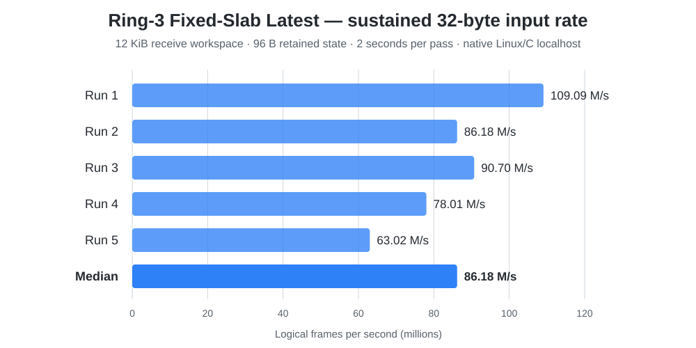
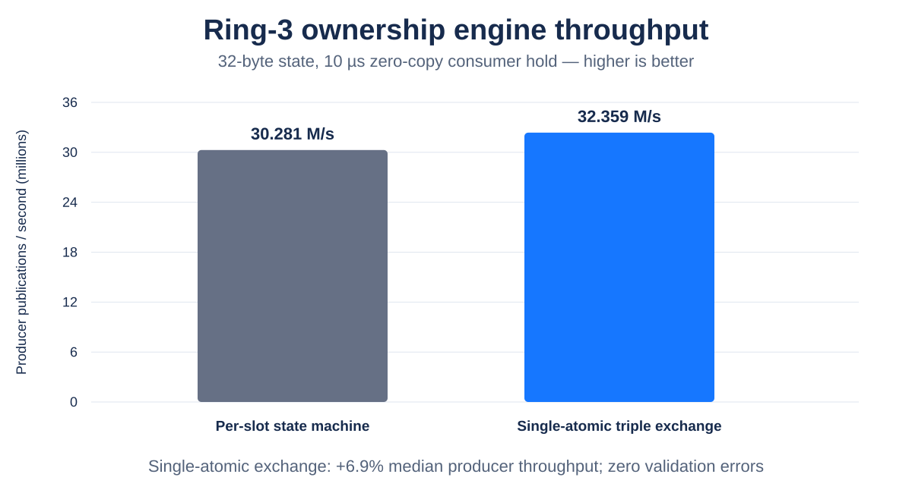
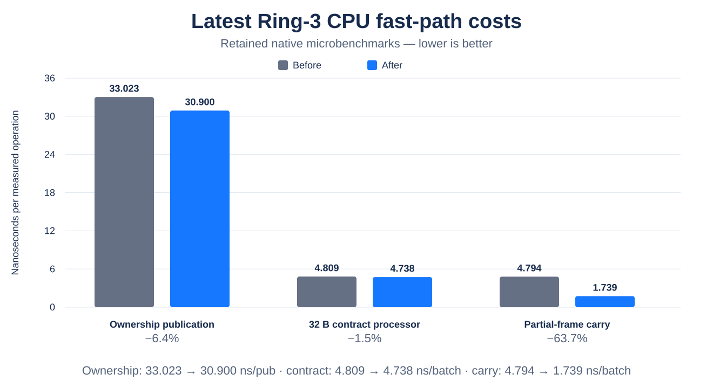
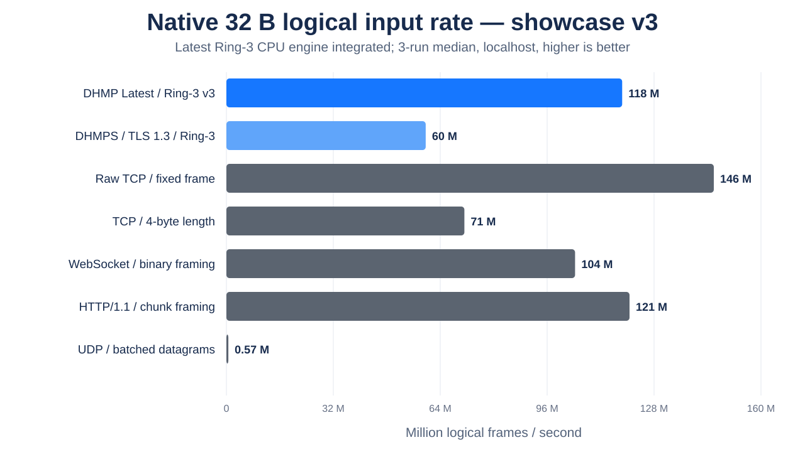
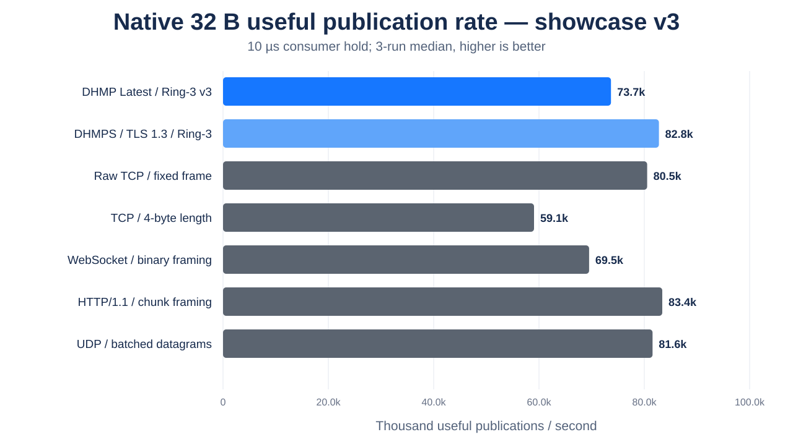

<p align="center">
  
</p>

# DHMP — Direct Headerless Message Protocol

DHMP is an experimental fixed-contract transport for persistent machine-to-machine communication.

The design goal is simple: **negotiate what can be known once, then keep repeated metadata, per-message allocation, queue growth, and unnecessary application work out of the steady-state hot path.**

DHMP is currently being developed as a protocol design plus reference implementations and benchmark labs. The main implementation target is .NET; native C labs are used to explore receive-path architectures before promising ideas are ported back into the .NET prototype.

> **Current highlighted `Latest` implementation:** Ring-3 Fixed-Slab Latest with a single-atomic `FRONT / MIDDLE / BACK` ownership exchange — three permanently retained state slots and one fixed reusable I/O workspace.

## At a glance

| Property | DHMP model |
| --- | --- |
| Framing | Fixed logical frame size negotiated once |
| Per-frame DHMP header | None in steady state |
| Connection model | Persistent continuous byte stream |
| Receive semantics | **Every** or **Latest** |
| Latest retention | Bounded newest-state window |
| Latest overflow | Always overwrite the oldest retained state |
| Delivery semantics | **Unconfirmed** or **Verified** |
| Secure mode | **DHMPS** over platform TLS |
| Memory model | Fixed reusable transport workspace + bounded retained state |
| Main target | Service-to-service, game/server state, telemetry, replication, devices |

## Why DHMP?

Many application protocols repeatedly send information that both peers already know after connection setup: schema identity, payload size, route information, message type, framing metadata, and other fixed contract details.

DHMP explores the opposite model:

```text
connection setup
    ↓
negotiate contract + fixed frame size + semantics
    ↓

steady state
[frame][frame][frame][frame][frame]...
```

rather than:

```text
[type][length][metadata][payload]
[type][length][metadata][payload]
[type][length][metadata][payload]
```

DHMP does **not** attempt to replace TCP reliability or TLS security. It sits above the underlying transport and removes application-level work that does not need to be repeated for every fixed-contract frame.

## Continuous data-pump model

A logical DHMP frame does not need to equal one socket read or write.

```text
TCP byte stream
      │
      ▼
┌──────────────────────────────┐
│ fixed reusable I/O workspace │
│ frame frame frame ... frame  │
└──────────────────────────────┘
      │
      ├── Every  → expose every complete frame
      │
      └── Latest → retain only newest useful state
```

This lets the implementation amortize one socket operation across many logical frames.

For `Latest`, obsolete complete frames do not need to become queued application objects at all. Once the negotiated frame size is known, the receiver can identify complete frame boundaries using fixed-size arithmetic and skip state that can no longer be observed.

## Receive semantics

### Every

`Every` exposes every complete logical frame in order.

Typical workloads:

- command streams;
- replication/change feeds;
- logs;
- telemetry where each sample matters;
- transactions or events that must not be discarded.

### Latest

`Latest` is for current-state workloads where newer state makes older state obsolete.

Typical workloads:

- game/server state;
- player or vehicle transforms;
- controller/device state;
- dashboards;
- simulation state;
- live UI state;
- high-frequency telemetry snapshots.

If the stream contains:

```text
[1][2][3][4][5]
```

and the consumer has fallen behind, a `Latest` implementation is allowed to discard stale state instead of forcing the application to process a growing backlog.

## Current Latest fast path: Ring-3 Fixed-Slab

The current highlighted native architecture uses two separate fixed-memory concepts:

1. **transport workspace** — a reusable contiguous slab that lets the OS perform efficient larger socket reads;
2. **retained state** — exactly three permanent buffers used as `FRONT / MIDDLE / BACK` ownership roles.

```text
network
   │
   ▼
┌──────────────────────────┐
│ fixed receive workspace  │
│ overwritten every cycle  │
└──────────────────────────┘
   │
   │ identify complete frames
   │ skip obsolete history
   ▼
┌────────┬────────┬────────┐
│ FRONT  │ MIDDLE │  BACK  │
└────────┴────────┴────────┘
 consumer   latest   producer
```

The producer writes only to `BACK`, then publishes it by atomically exchanging `BACK ↔ MIDDLE`. The consumer owns `FRONT`; when a newer state is available it exchanges `FRONT ↔ MIDDLE`. An older unconsumed `MIDDLE` state may be replaced by a newer one, which is exactly the intended `Latest` conflation behavior.

The implementation does not shift old frame data forward, grow a queue, or clear memory before reuse. Payload storage stays fixed; only ownership roles move.

For a 32-byte contract:

```text
3 × 32 B = 96 B retained application-state payload
```

The retained-state requirement stays constant regardless of how long the connection runs.

### Earlier standalone Ring-3 reference result



Standalone native Linux/C localhost reference from before the latest single-atomic CPU ownership work, five 2-second passes:

| Metric | Result |
| --- | ---: |
| Frame size | **32 B** |
| Median logical input rate | **86.18 M frames/s** |
| Median logical payload rate | **2.76 GB/s** |
| Median receiver CPU / logical frame | **3.71 ns** |
| Retained application-state payload | **96 B** |
| Fixed receive workspace | **12 KiB** |
| Obsolete frames skipped/overwritten | **~99.20%** |
| Measured run range | **63.02–109.09 M frames/s** |

This is a localhost architecture benchmark, not a claim that a physical network delivered 2.76 GB/s. The run range is intentionally published because scheduler and loopback conditions materially affect absolute rates.

Source: [`benchmarks/native-gen2/ring3_fixed_slab_latest.c`](benchmarks/native-gen2/ring3_fixed_slab_latest.c)  
Raw results: [`ring3-fixed-slab-latest-32b-2026-09-23.csv`](benchmarks/results/ring3-fixed-slab-latest-32b-2026-09-23.csv)

### Latest Ring-3 CPU optimization results

The Ring-3 ownership path has now been reduced from a per-slot atomic state machine to a classic SPSC triple-buffer exchange. The producer owns `BACK`, the consumer owns `FRONT`, and one 32-bit atomic `MIDDLE` token transfers ownership.

Seven alternating native CPU runs with 32-byte state and a 10 µs zero-copy consumer hold:



| Ring-3 ownership engine | Producer publications/s | Producer CPU / publication | Producer claim retries | Useful consumer publications/s | Validation errors |
| --- | ---: | ---: | ---: | ---: | ---: |
| Per-slot state machine | 30.281 M | 33.023 ns | ~30.11 M | 89.745k | 0 |
| **Single-atomic triple exchange** | **32.359 M** | **30.900 ns** | **0** | 89.308k | **0** |

That is about **+6.9% producer publication throughput** and **-6.4% producer CPU cost** while removing the producer-side slot-claim retry loop.

Two additional retained CPU-path improvements were retained and are now integrated into showcase v3:



| Processor detail | Before | After | Change |
| --- | ---: | ---: | ---: |
| 32-byte negotiated contract processing | 4.809 ns/batch | **4.738 ns/batch** | **~1.5% lower** |
| Partial-frame carry handling | 4.794 ns/batch | **1.739 ns/batch** | **~63.7% lower** |

The contract-specialized path replaces runtime division/runtime-size copy with fixed 32-byte arithmetic/copy. The carry fast path replaces variable-size `memmove` with one fixed 32-byte vector transfer while retaining the actual valid carry count separately.

These are **processor-path microbenchmarks**. The current end-to-end native integration of these changes is showcase v3 below.

Source/results:

- [single-atomic triple exchange source](benchmarks/native-gen2/ring3_triple_exchange_ab.c)
- [single-atomic raw results](benchmarks/results/ring3-triple-exchange-ab-2026-09-23.csv)
- [contract specialization raw results](benchmarks/results/ring3-contract-specialize-ab-2026-09-23.csv)
- [fixed carry raw results](benchmarks/results/ring3-carry32-ab-2026-09-23.csv)

## Performance comparisons

DHMP has several benchmark families. Results from different harnesses are deliberately kept separate.

### Current native 32-byte showcase v3 — latest Ring-3 engine

Showcase v3 integrates the retained CPU work into the actual localhost transport path:

- Ring-3 `FRONT / MIDDLE / BACK` ownership;
- one shared 32-bit atomic `MIDDLE` token;
- one ownership exchange per publication;
- negotiated 32-byte shift/mask framing;
- fixed 32-byte vector publication copy;
- fixed-width partial-frame carry handling;
- 12 KiB receive workspace;
- 256 KiB reusable sender batch;
- 10 µs zero-copy consumer hold;
- TLS 1.3 for DHMPS.

The framing baselines use the same `Latest` consumer/publication model so the comparison focuses on receive/framing work rather than giving DHMP a different consumer workload.





Three-run medians:

| Path | Logical input | Useful publications | Receiver CPU / logical frame | Input run range |
| --- | ---: | ---: | ---: | ---: |
| **DHMP Latest / Ring-3 v3** | **118.45 M/s** | **73.67k/s** | **2.736 ns** | 97.93–127.90 M/s |
| DHMPS / TLS 1.3 / Ring-3 | 59.66 M/s | 82.78k/s | 10.861 ns | 36.15–62.81 M/s |
| Raw TCP / fixed frame | 145.88 M/s | 80.54k/s | 2.489 ns | 109.14–147.72 M/s |
| TCP / 4-byte length | 71.22 M/s | 59.06k/s | 4.399 ns | 68.11–124.07 M/s |
| WebSocket / binary framing | 104.36 M/s | 69.51k/s | 3.925 ns | 83.36–125.89 M/s |
| HTTP/1.1 / chunk framing | 120.66 M/s | 83.42k/s | 4.202 ns | 43.54–122.05 M/s |
| UDP / batched datagrams | 0.574 M/s | 81.56k/s | 690.13 ns | 0.456–0.673 M/s |

All retained v3 runs reported **zero payload-validation errors and zero framing-validation errors**.

The absolute localhost rates varied substantially between passes, so v3 publishes the run ranges rather than presenting the medians as a universal ceiling. The raw fixed-TCP row is intentionally extremely lean and should remain difficult to beat; DHMP's goal is to stay near that transport floor while providing fixed-contract and explicit `Latest` semantics.

The HTTP and WebSocket rows are framing/parser microbenchmarks, not full framework/server-stack measurements. The UDP row uses Linux `sendmmsg/recvmmsg` batching. Logical GB/s and frame rates are loopback/hot-path measurements, not physical NIC throughput.

Showcase v3 changes the harness relative to v2 — notably the sender batch and publication engine — so **v2 and v3 absolute rates should not be interpreted as a direct before/after speedup measurement**. The dedicated CPU A/B tests above are the controlled evidence for the optimization gains.

Source: [`showcase_v3.c`](benchmarks/native-showcase/showcase_v3.c)  
Runner: [`run_showcase_v3.py`](benchmarks/native-showcase/run_showcase_v3.py)  
Raw results: [`showcase-v3-32b-raw-3run-2026-09-23.csv`](benchmarks/results/showcase-v3-32b-raw-3run-2026-09-23.csv)  
Summary: [`showcase-v3-32b-summary-3run-2026-09-23.csv`](benchmarks/results/showcase-v3-32b-summary-3run-2026-09-23.csv)

### Historical results

Older .NET request/reply, DHMPS/HTTPS, and native showcase v2 measurements are retained in [the detailed benchmark history](docs/BENCHMARKS.md) for reproducibility, but are intentionally omitted from the main README so this page reflects the current Ring-3 engine.

## Continuous streaming results

The .NET continuous-streaming benchmark removes request/reply waiting and sends fixed-size frames continuously.

| Payload | DHMP frames/s | Payload throughput |
| ---: | ---: | ---: |
| 16 B | ~206k | ~3.15 MiB/s |
| 32 B | ~228k | ~6.95 MiB/s |
| 64 B | ~224k | ~13.65 MiB/s |
| 128 B | ~222k | ~27.15 MiB/s |
| 256 B | ~225k | ~54.92 MiB/s |
| 512 B | ~218k | ~106.41 MiB/s |
| 1 KiB | ~207k | ~202.21 MiB/s |
| 2 KiB | ~192k | ~374.33 MiB/s |
| 4 KiB | ~179k | ~697.79 MiB/s |
| 8 KiB | ~141k | ~1.10 GiB/s |

These results illustrate the transition from per-operation overhead at small frame sizes toward byte movement, socket buffering, and memory bandwidth at larger sizes.

## Delivery semantics

Receive semantics and delivery/recovery semantics are separate.

### Unconfirmed

The sender continuously emits frames without requiring DHMP-level proof that the peer accepted every logical frame.

TCP still provides ordered reliable byte delivery while the connection remains alive. If the session dies, uncertain application frames may be abandoned.

### Verified

Verified keeps the same no-wait hot data stream:

- no per-frame ACK;
- no periodic ACK merely because data is flowing;
- sender continues sending;
- sender retains uncertain logical history;
- reconnect/verification establishes the receiver's accepted stream position;
- only the uncertain tail is replayed.

The remaining design problem is **bounded Verified history**: asynchronous checkpoints need to confirm an accepted position so old retained history can be released without turning the normal stream into request/reply traffic.

## DHMP and DHMPS

**DHMP** is the plain application transport.

**DHMPS** is DHMP carried through normal platform TLS.

DHMPS does not invent custom cryptography. TLS framing exists below DHMP, while DHMP itself keeps the same fixed-contract application-frame model.

## Intended use cases

DHMP is being explored for workloads such as:

- service-to-service communication;
- multiplayer game/server state;
- controller/device communication;
- real-time state distribution;
- telemetry;
- simulation;
- cache synchronization;
- replication/change feeds;
- log shipping;
- edge/backend synchronization.

The strongest fit is communication that is:

- persistent;
- high-frequency;
- fixed-contract;
- small-to-medium message oriented;
- sensitive to allocation, queue growth, or stale-state processing.

DHMP is **not** intended to reproduce every feature of HTTP, gRPC, Kafka, MQTT, QUIC, or a message broker inside one protocol. Higher-level features should remain layered above the small transport core.

## Benchmark discipline

DHMP uses several different benchmark harnesses. Their absolute numbers should not be mixed casually.

- **.NET protocol benchmarks** compare real .NET stacks and application APIs.
- **native showcase benchmarks** compare framing/ingestion paths inside one C harness.
- **processor-path labs** explore algorithms and memory models.
- **Ring-3 standalone tests** validate the newest bounded-state implementation shape.

A higher native-lab number does not mean the .NET implementation currently achieves the same rate, and a logical payload rate does not mean a physical NIC transferred that many bytes per second.

Raw CSV files, source code, methodology, and caveats are retained so results remain reproducible.

## Current status

DHMP is experimental work and is not yet a frozen interoperability specification.

Established so far:

- fixed-contract/headerless steady-state framing;
- arbitrary negotiated fixed frame sizes;
- `Every` and `Latest` receive semantics;
- Ring-3 bounded newest-state implementation experiments;
- single-atomic `FRONT / MIDDLE / BACK` Ring-3 ownership exchange;
- overwrite-oldest Latest behavior;
- fixed reusable I/O workspace;
- plain DHMP and TLS-wrapped DHMPS;
- Unconfirmed delivery;
- no-periodic-ACK Verified recovery;
- reconnect/replay of uncertain Verified tails;
- reusable-slab/bulk-I/O implementation model;
- comparisons against lean TCP, MessagePack, WebSocket, HTTP, HTTPS, UDP, and gRPC.

Current engineering priorities:

1. port Ring-3 Fixed-Slab Latest and the single-atomic ownership path into the .NET prototype;
2. extend showcase v3 across negotiated frame sizes;
3. repeat v3 with longer runs and on physical LAN hardware to reduce localhost scheduling variance;
4. tune receive-workspace and sender-batch sizing across negotiated frame sizes;
5. implement bounded Verified checkpoints;
6. continue separating protocol specification from implementation details;
7. build ergonomic .NET/Unity-facing APIs without adding per-frame wire overhead.

## Documentation

- [Protocol draft](docs/PROTOCOL_DRAFT.md)
- [Current development status](docs/CURRENT_STATUS.md)
- [Benchmark methodology and detailed results](docs/BENCHMARKS.md)
- [Native Gen-2 processor lab](benchmarks/native-gen2)
- [Raw benchmark results and charts](benchmarks/results)

## Requirements

The main prototype targets **.NET 10**.

A separate Linux/C native lab under `benchmarks/native-gen2` is used for architecture and processor-path experiments before selected ideas are ported to the .NET implementation.
