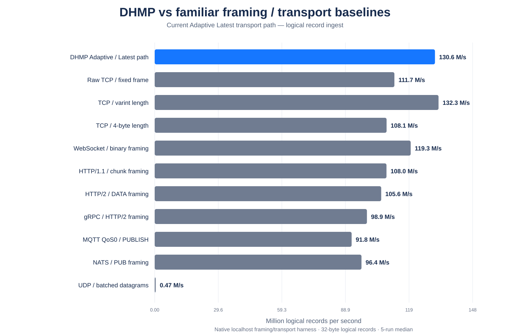
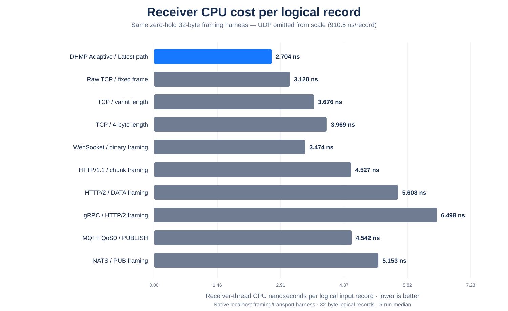

<p align="center">
  
</p>

# DHMP — Direct Headerless Message Protocol

DHMP is an experimental fixed-contract protocol and adaptive runtime architecture for persistent machine-to-machine communication.

The goal is straightforward:

> **Negotiate what can be known once, then keep repeated metadata, unnecessary copies, per-message synchronization, queue growth, and avoidable processing out of the steady-state path.**

# Performance showcase

## What are we testing?

The headline native showcase answers a narrow question first:

> **How much work does the DHMP transport/framing path add when moving a continuous stream of fixed 32-byte logical records, compared with familiar framing/transport shapes under the same local harness?**

Headline transport/framing setup:

| Item | Test setup |
| --- | --- |
| Logical record | 32 bytes |
| Transport | localhost Linux native/C |
| DHMP semantics | `Latest`, current retained Ring-3 path |
| Receive workspace | 12 KiB reusable slab |
| Sender batch | 256 KiB reusable batch |
| Artificial consumer delay | **0 µs** |
| Runs | 5 rotated runs, median shown |
| Validation | payload + framing validation |
| CPU placement | sender / receiver / consumer pinned when available |

The comparison includes raw fixed TCP, varint-length TCP, 4-byte-length TCP, WebSocket binary framing, HTTP/1.1 chunk framing, HTTP/2 DATA framing, gRPC/HTTP2 framing, MQTT QoS0 PUBLISH, NATS PUB, and batched UDP.

The WebSocket/HTTP/gRPC/MQTT/NATS rows are **framing/parser hot-path shapes in the same native harness**, not full production server/framework stacks. Logical GB/s below means application payload represented by logical records; it is **not physical NIC throughput**.

## How many records can it handle?

<p align="center">
  
</p>

Five-run median logical input rates:

| Path | Logical records/s | Logical payload |
| --- | ---: | ---: |
| **DHMP Adaptive / Latest path** | **130.62 M/s** | **4.18 GB/s** |
| Raw TCP / fixed frame | 111.73 M/s | 3.58 GB/s |
| TCP / varint length | 132.30 M/s | 4.23 GB/s |
| TCP / 4-byte length | 108.08 M/s | 3.46 GB/s |
| WebSocket / binary framing | 119.32 M/s | 3.82 GB/s |
| HTTP/1.1 / chunk framing | 108.03 M/s | 3.46 GB/s |
| HTTP/2 / DATA framing | 105.57 M/s | 3.38 GB/s |
| gRPC / HTTP/2 framing | 98.92 M/s | 3.17 GB/s |
| MQTT QoS0 / PUBLISH | 91.79 M/s | 2.94 GB/s |
| NATS / PUB framing | 96.38 M/s | 3.08 GB/s |
| UDP / batched datagrams | 0.466 M/s | 0.015 GB/s |

In this harness DHMP is essentially at the fixed-stream transport floor. The one-byte varint TCP row has a slightly higher median input rate (**132.30 vs 130.62 M/s**), while DHMP uses less receiver CPU per logical record.

Relative to the same-harness rows, DHMP measured approximately:

| Compared with | DHMP logical-rate difference | DHMP receiver-CPU reduction |
| --- | ---: | ---: |
| Raw fixed TCP | **+16.9%** | **13.3% less** |
| TCP varint length | **-1.3%** | **26.4% less** |
| TCP 4-byte length | **+20.9%** | **31.9% less** |
| WebSocket framing | **+9.5%** | **22.2% less** |
| HTTP/1.1 chunk framing | **+20.9%** | **40.3% less** |
| HTTP/2 DATA framing | **+23.7%** | **51.8% less** |
| gRPC/HTTP2 framing | **+32.0%** | **58.4% less** |
| MQTT QoS0 framing | **+42.3%** | **40.5% less** |
| NATS PUB framing | **+35.5%** | **47.5% less** |

These percentages describe this native benchmark only; they are not claims about complete deployed framework stacks.

## How much CPU does receiving one record cost?

<p align="center">
  
</p>

The DHMP `Latest` path measured **2.704 ns of receiver-thread CPU per logical 32-byte input record** at the five-run median.

That metric counts receiver-thread processing time per logical input frame. It is not total system CPU and does not include application work performed later.

[Showcase methodology](benchmarks/native-showcase/V4_ZERO_HOLD.md) · [Raw/summary results](benchmarks/results/showcase-v4-zero-hold-32b-summary-5run-2026-09-23.csv)

## What can the latest Adaptive engine process?

The transport graph above measures the retained `Latest` branch. The newer `Every`, fused-processing, zero-copy slab, and ComputeBlock work uses separate matched A/B harnesses.

<p align="center">
  
</p>

Current demonstrated capability points:

| Current path | Rate | Logical data rate | Key CPU/result metric |
| --- | ---: | ---: | ---: |
| Adaptive `Latest` transport ingest | **130.62 M records/s** | **4.18 GB/s** | **2.704 ns receiver CPU/record** |
| Adaptive `Every` output-slab pipeline | **129.80 M results/s** | **4.15 GB/s** | **6.988 ns processor CPU/result** |
| Adaptive `Every` borrowed receive slab | **126.51 M records/s** | **4.05 GB/s** | **6.184 ns receiver CPU/record** |
| ComputeBlock SoA + AVX2 processor-only kernel | **1.610 B results/s** | **51.5 GB/s logical records** | **0.621 ns CPU/result** |

The ComputeBlock number is deliberately labelled **processor-only**. It isolates the numerical kernel and does not mean a network interface transferred 51.5 GB/s.

## How much did the newest optimizations change the engine?

<p align="center">
  
</p>

Each bar has its own matched baseline. The gains are **not additive**.

| Optimization | Before | Current retained result | Change |
| --- | ---: | ---: | ---: |
| `Every`: per-result → output-slab publication | 33.35 M/s | **129.80 M/s** | **3.89×** |
| ComputeBlock: AoS AVX2 → SoA AVX2 | 925.9 M/s processor-only | **1.610 B/s** | **1.74×** |
| Per-message → fused batch processing | 30.82 M/s | **35.92 M/s** | **+16.5%** |
| Receive-copy → borrowed receive slab | 119.63 M/s | **126.51 M/s** | **+5.8%** |
| Sender scratch copy → direct slab send | 41.93 M/s | **43.98 M/s** | **+4.9%** |
| Inline → dedicated batch delivery worker | workload-dependent | **+18.7% to +48.5%** | parallel throughput |
| Variable carry → fixed 32-byte carry | 4.794 ns/batch | **1.739 ns/batch** | **~63.7% lower** |
| Per-slot Ring-3 atomics → single MIDDLE token | 30.28 M pubs/s | **32.36 M pubs/s** | **~+6.9%** |

All retained correctness runs reported zero validation errors.

---

# How the current DHMP model works

The project no longer exposes one Ring or one Slab design as the universal answer. The retained architecture is **Adaptive Fixed-Contract**.

<p align="center">
  
</p>

The application first chooses the correctness semantics it needs:

```text
Every
  = every logical record must be preserved

Latest
  = newer state may replace stale unconsumed state
```

The handshake then fixes the record or block contract, representation, and security mode. Once those facts are known, the runtime can choose the fastest implementation path that preserves the requested semantics.

**Adaptive never turns `Every` into `Latest` just because dropping work would be faster.**

## Latest — newest useful state

```text
TCP / TLS
   ↓
fixed reusable receive workspace
   ↓
identify complete frames
   ↓
skip obsolete complete states
   ↓
copy newest useful state only
   ↓
compact Ring-3
 FRONT / MIDDLE / BACK
   ↓
consumer
```

For a 32-byte contract:

```text
3 × 32 B = 96 B retained application payload
```

The current Ring-3 implementation uses one shared 32-bit `MIDDLE` token. The producer owns `BACK`, the consumer owns `FRONT`, and only ownership roles move.

This avoids queue growth, state shifting, repeated allocation, and processing of stale states that the application can no longer observe.

Typical fits include game/server state, position/velocity updates, device/controller state, dashboards, live UI state, and current-value telemetry.

## Every — bounded slab ownership

`Every` cannot overwrite unread records. The retained path therefore uses a fixed pool of reusable slabs with bounded backpressure.

```text
bounded receive-slab pool
        ↓
recv directly into owned slab
        ↓
publish {offset, count}
        ↓
optional fused conversion
        ↓
batch adapter / developer
        │
        └── or direct slab-to-send forwarding
        ↓
release ownership
```

### Publish a batch, not every message

<p align="center">
  
</p>

Both compared paths retained the same **96 KiB bounded output capacity**.

| Every path | End-to-end | Processor CPU/result | Consumer CPU/result | Results/publication |
| --- | ---: | ---: | ---: | ---: |
| Per-result publication | 33.35 M/s | 29.933 ns | 29.978 ns | 1.0 |
| **Output-slab publication** | **129.80 M/s** | **6.988 ns** | **7.699 ns** | **372.3** |

The processor writes a populated receive batch sequentially into a claimed output slab and transfers ownership once. If all slabs are still unread, the producer waits rather than overwriting `Every` data.

### Borrow the receive slab

If the received wire representation already matches what downstream code needs, DHMP can skip the complete-frame input→output copy entirely.

The receiver takes a slab from the bounded pool, receives directly into it, publishes an `offset + count` view, and reuses the slab only after downstream code releases it.

Split TCP frames use a tiny carry buffer; only those boundary fragments move.

## Fused batch processing

Storage and ownership are only part of the cost. The runtime can also fuse the **actual developer-facing computation** across a batch.

<p align="center">
  
</p>

| Routine | End-to-end results/s | Processor CPU/result |
| --- | ---: | ---: |
| Per-message scalar | 30.82 M/s | 32.451 ns |
| **Fused scalar batch** | **35.92 M/s** | **27.771 ns** |
| Fused AVX2 | 35.81 M/s | 27.872 ns |
| Fused AVX-512 gather/scatter | 34.34 M/s | 29.061 ns |

The retained rule is **fuse first, then select SIMD by contract and layout**. Wider vectors are not automatically faster.

## ComputeBlock — computation-ready wire blocks

For numerical workloads DHMP can optionally negotiate the layout of a whole fixed block:

```text
ordinary AoS
[x y z vx vy vz temp scale]
[x y z vx vy vz temp scale]
...

computation-ready SoA
[x x x x ...]
[y y y y ...]
[z z z z ...]
[vx vx vx ...]
[vy vy vy ...]
[vz vz vz ...]
[temp ...]
[scale ...]
```

The SoA representation itself travels over the wire. The processor can load contiguous field arrays directly instead of first transposing ordinary records.

<p align="center">
  
</p>

| Layout / routine | CPU/result | Processor result rate |
| --- | ---: | ---: |
| AoS scalar | 2.434 ns | 410.9 M/s |
| AoS + AVX2 transpose | 1.080 ns | 925.9 M/s |
| SoA scalar | 2.370 ns | 421.9 M/s |
| **SoA + AVX2 contiguous fields** | **0.621 ns** | **1.610 B/s** |

This is about **42.5% lower isolated compute cost** than AoS+AVX2 and about **1.74× the processor rate**.

The full localhost pipeline showed only about a 1.7% improvement because other stages then dominated. ComputeBlock is therefore an optional path for array-native simulation, telemetry, physics/numerical processing, and similar workloads—not the default for unrelated commands.

## Delivery worker and language adapters

The high-performance public interface is intended to be **batch-first**.

A dedicated delivery worker can acquire a whole populated slab, perform decoding/conversion/application preparation, make one language-adapter crossing for the batch, and release the slab afterward.

In tested synthetic conversion workloads the dedicated worker improved wall-clock throughput by **18.7% to 48.5%** when placed sensibly in the cache topology. Aggregate CPU can increase because two cores are doing useful work simultaneously.

A per-message convenience API can sit above the batch API, but the protocol core should not be forced back into hundreds of ownership transfers or callbacks per slab.

## Direct slab-to-send forwarding

For processing services that forward wire-ready results:

```text
processor owns output slab
        ↓
writes final wire representation
        ↓
sender acquires the same slab
        ↓
send bytes directly
        ↓
release only after transport no longer needs them
```

The native A/B improved median forwarding throughput from **41.93 M/s to 43.98 M/s** (~**+4.9%**) by removing the application-level output-slab → sender-buffer copy.

This does not imply elimination of kernel or TLS copies.

---

# Protocol versus implementation

DHMP keeps interoperability rules separate from platform-specific acceleration.

| Protocol-level | Runtime / implementation-level |
| --- | --- |
| Fixed-contract handshake | Ring-3 ownership |
| Fixed record or fixed block layout | Slab size/count |
| `Every` / `Latest` semantics | 32-bit ownership token |
| Unconfirmed / Verified delivery | Fixed-width carry path |
| Optional ComputeBlock layout | Fused/SIMD routine selection |
| DHMP / DHMPS | Delivery worker |
|  | CPU/cache placement |
|  | send/receive batching |
|  | socket buffers / polling |
|  | future `io_uring`, registered buffers, kTLS, zero-copy |

This allows other implementations in .NET, C/C++, Rust, Go, Java, Unity, Python adapters, and other environments without making one Linux optimization part of the protocol.

# Delivery semantics

Receive semantics and recovery semantics are separate.

### Unconfirmed

The sender streams without requiring DHMP-level proof/replay for every logical record. TCP still provides ordered reliable byte delivery while the connection remains alive.

### Verified

Verified keeps the normal hot path streaming:

- no per-frame DHMP ACK;
- sender retains uncertain logical history;
- reconnect/checkpoint establishes the receiver's accepted position;
- only the uncertain tail is replayed.

The remaining implementation work is bounded asynchronous checkpoint/history reclamation.

# DHMP and DHMPS

**DHMP** uses the fixed-contract model over the underlying transport.

**DHMPS** carries the same model through standard platform TLS. DHMP does not invent custom cryptography.

TLS remains a substantial CPU layer and has not yet received the same tuning depth as the plain native path.

# Benchmark discipline

The README intentionally shows several different benchmark layers because they answer different questions.

| Benchmark family | What it measures |
| --- | --- |
| Cross-protocol native showcase | Transport/framing ingest and receiver CPU |
| Integrated `Every` labs | Ownership, copies, processing and delivery |
| Processor microbenchmarks | Isolated CPU/layout limits |
| Slow-consumer tests | Ownership/conflation correctness |
| .NET benchmarks | Actual .NET implementation/framework behavior |

Do not compare a processor-only 1.610 B results/s number directly with a socket ingest rate and call it network throughput. Do not add independent optimization percentages together.

Raw source, CSV data, summaries, methodology and historical results are retained in the repository.

# Current engineering priorities

1. **Port the retained Adaptive paths into the .NET implementation.**
2. Build a new common benchmark harness around the current Adaptive code and rerun the cross-protocol showcase from that integrated implementation.
3. Tune receive workspace, sender batch, `SO_RCVBUF`, `SO_SNDBUF`, polling, CPU placement, and TLS.
4. Repeat combined tests on physical LAN hardware with longer runs and hardware counters.
5. Measure ComputeBlock accumulation latency and sender-side layout/repacking costs.
6. Implement bounded Verified checkpoints.

# Documentation

- [Architecture comparison and retained model](docs/ARCHITECTURE_COMPARISON.md)
- [Current development status](docs/CURRENT_STATUS.md)
- [Protocol draft](docs/PROTOCOL_DRAFT.md)
- [Benchmark methodology and full history](docs/BENCHMARKS.md)
- [Transport/runtime tuning follow-up](docs/TRANSPORT_TUNING_TODO.md)
- [Native showcase labs](benchmarks/native-showcase)
- [Native processor labs](benchmarks/native-gen2)
- [Raw benchmark results and charts](benchmarks/results)

# Requirements

The primary implementation target is **.NET 10**.

The newest architecture work currently lives in native Linux/C benchmark labs so design changes can be validated quickly before the retained paths are ported into the production-facing .NET implementation.
