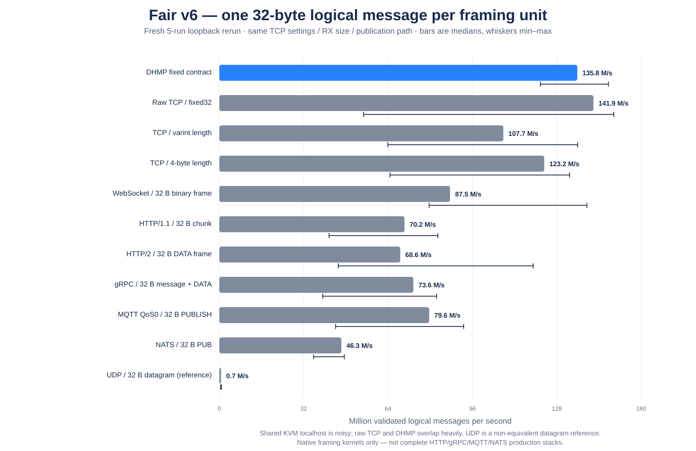
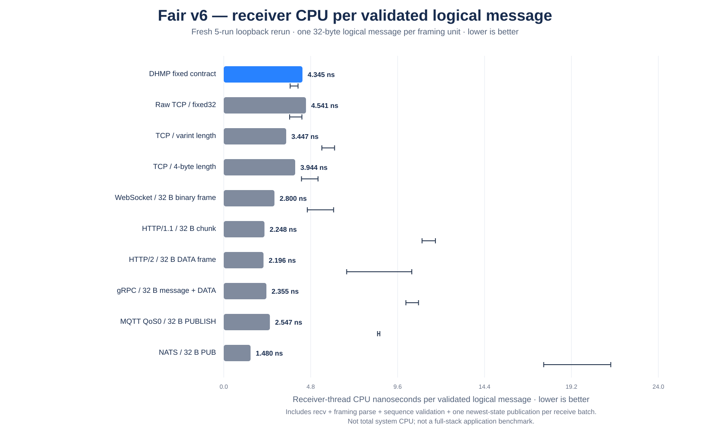
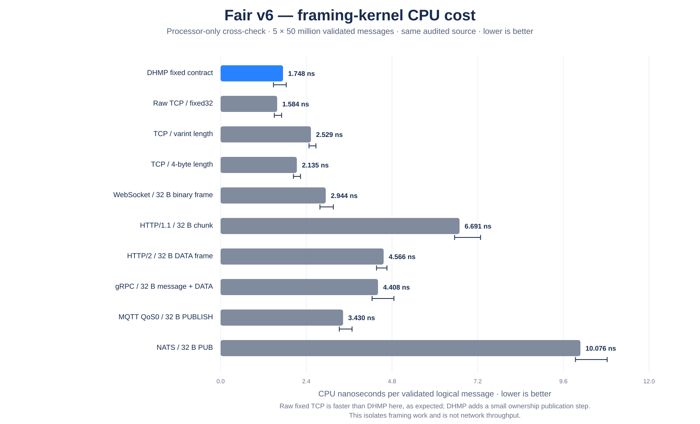
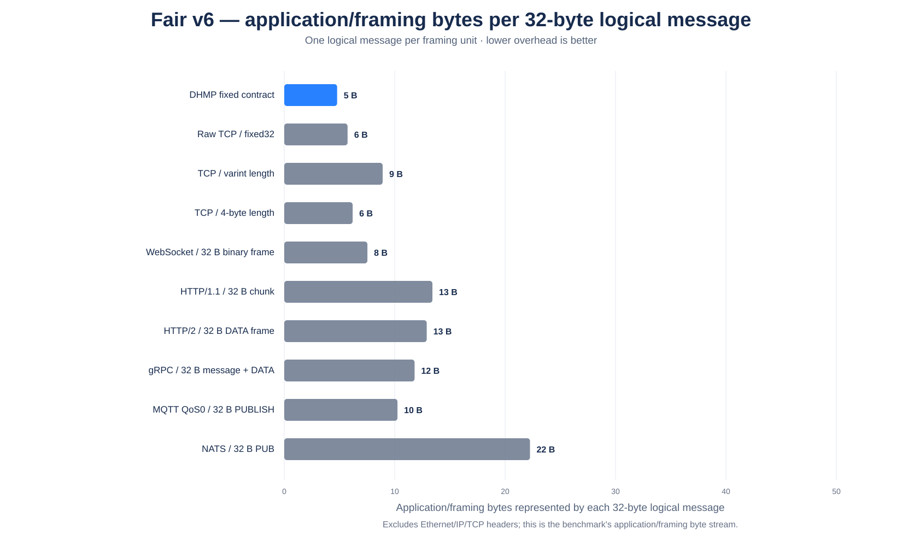
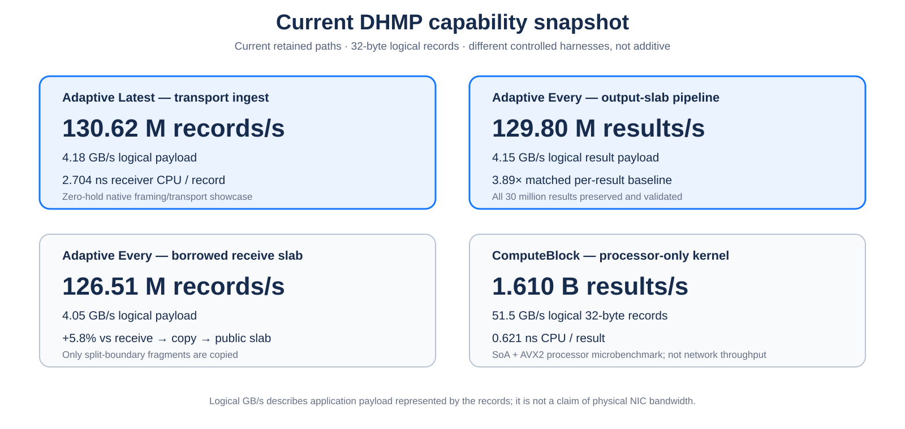
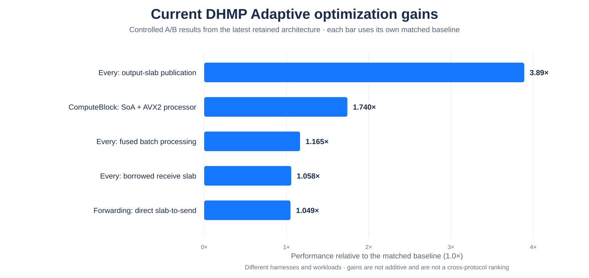
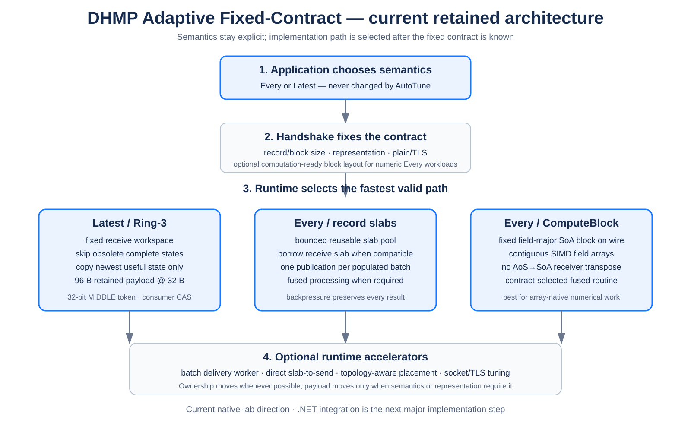
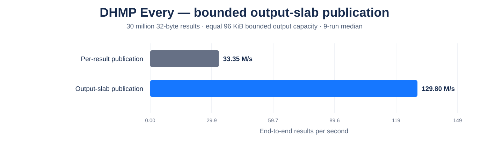
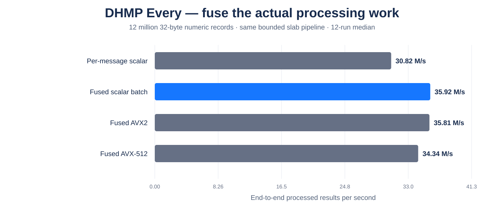
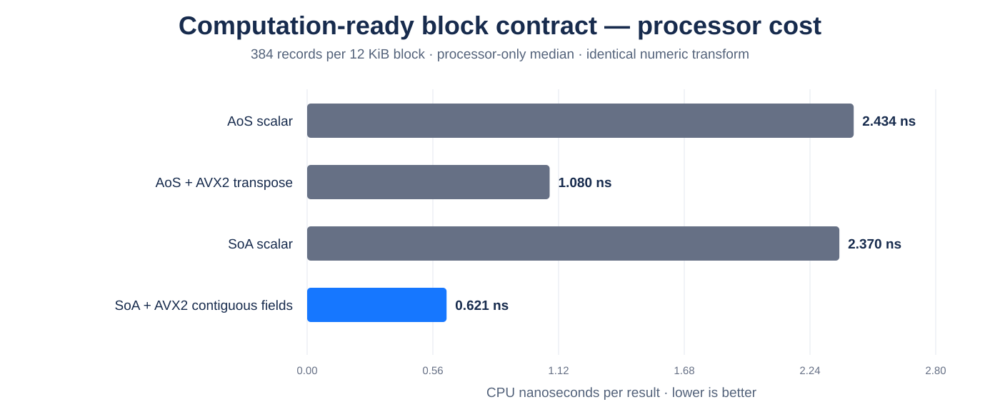

<p align="center">
  
</p>

# DHMP — Direct Headerless Message Protocol

DHMP is an experimental fixed-contract protocol and adaptive runtime architecture for persistent machine-to-machine communication.

The goal is straightforward:

> **Negotiate what can be known once, then keep repeated metadata, unnecessary copies, per-message synchronization, queue growth, and avoidable processing out of the steady-state path.**

# Performance showcase

## Fair benchmark status

The project currently has **two different classes of benchmark evidence**, and they must not be confused.

| Comparison | Status | Can this support a headline claim? |
| --- | --- | --- |
| DHMP vs raw TCP / length-prefixed TCP in the frozen native C harness | **Tested** | Yes, for this exact native framing/transport harness |
| DHMP vs WebSocket / HTTP/1.1 / HTTP/2 / gRPC / MQTT / NATS **framing shapes** in the same native C harness | **Tested** | Yes, but only as framing/parser hot-path comparisons |
| DHMP vs real ASP.NET Core HTTP/1.1 | **Not yet fairly tested against current Adaptive DHMP** | **No** |
| DHMP vs real ASP.NET Core HTTP/2 | **Not yet fairly tested against current Adaptive DHMP** | **No** |
| DHMP vs real grpc-dotnet | **Not yet fairly tested against current Adaptive DHMP** | **No** |
| DHMP vs real System.Net.WebSockets | **Not yet fairly tested against current Adaptive DHMP** | **No** |
| DHMP vs a real MQTT broker/client | **Not yet fairly tested** | **No** |
| DHMP vs official/version-pinned NATS client + NATS server | **Not yet fairly tested** | **No** |
| DHMPS vs HTTPS / secure HTTP2 under one frozen TLS harness | **Not yet rerun for the current engine** | **No** |

**Therefore the current README does not claim that DHMP is faster than complete HTTP/2, gRPC, WebSocket, MQTT, or NATS production stacks.** Those rows remain unmeasured until we run real implementations together under one frozen harness.

If a future fair full-stack benchmark shows DHMP is slower, the slower DHMP result will be published.

## What are we testing today?

The current headline comparison is **showcase v6**, a fresh rerun created after auditing the benchmark itself.

The audit found a real fairness problem in the older comparison: WebSocket/HTTP/1.1/HTTP/2 had been allowed to amortize one framing header over roughly **8 KiB / 256 logical records**, while several other paths paid framing for every 32-byte record.

v6 removes that mismatch:

> **One 32-byte logical application message per protocol framing unit.**

### Frozen v6 setup

| Item | v6 setup |
| --- | --- |
| Logical message | **32 bytes** |
| Stream transport | localhost TCP |
| Framing granularity | **1 logical message per framing unit** |
| Receiver read target | 12 KiB |
| Sender wire cycle | ~256 KiB |
| Actual socket buffers | 8 MiB send / 8 MiB receive |
| TCP setting | TCP_NODELAY on every TCP path |
| Artificial consumer delay | **0 µs** |
| Thread placement | sender CPU 0 / receiver CPU 1 / consumer CPU 2 |
| Warmup | 300 ms |
| Measurement | 0.8 s/path |
| Runs | **5 rotated runs** |
| Validation | full ordered payload sequence + framing validation |
| Build | GCC 14.2.0, `-O3 -mavx2 -pthread -std=c11` |

Before the retained run, the source passed strict warning-free compilation, fragmented-input self-tests, corruption tests, AddressSanitizer and UndefinedBehaviorSanitizer self-tests, and CPU-affinity validation.

Across the retained v6 loopback runs there were:

- **0 framing errors**
- **0 payload-sequence errors**
- **0 consumer validation errors**
- **0 UDP payload errors**
- **0 configuration errors**

[Full v6 audit and methodology](benchmarks/native-showcase/V6_FAIR_PER_MESSAGE.md)

### What each native row means

| Row | v6 application/framing bytes per 32 B logical message | Framing unit used |
| --- | ---: | --- |
| **DHMP fixed contract** | **32 B** | fixed record; no repeated DHMP header |
| Raw TCP / fixed32 | 32 B | fixed record |
| TCP / varint length | 33 B | 1-byte length + payload |
| TCP / 4-byte length | 36 B | 4-byte length + payload |
| WebSocket | 34 B | unmasked 32-byte binary frame |
| HTTP/1.1 | 38 B | one 32-byte chunk |
| HTTP/2 | 41 B | one 32-byte DATA frame |
| gRPC/H2 shape | 46 B | one DATA frame + one 5-byte gRPC envelope + payload |
| MQTT QoS0 | 37 B | one minimal PUBLISH with 1-byte topic |
| NATS | 44 B | one PUB record |
| UDP | 32 B application payload | one datagram; non-equivalent reference |

These are **native framing kernels**, not complete production stacks. HTTP chunks and HTTP/2 DATA frames are not application-message standards; using one framing unit per logical message is an explicit normalization rule for this test.

## Fresh fair v6 loopback result

<p align="center">
  
</p>

| Path | Median logical messages/s | 5-run range | Median logical payload |
| --- | ---: | ---: | ---: |
| Raw TCP / fixed32 | **141.90 M/s** | 54.74–149.63 M/s | **4.54 GB/s** |
| **DHMP fixed contract** | **135.78 M/s** | 121.76–147.58 M/s | **4.34 GB/s** |
| TCP / 4-byte length | 123.25 M/s | 64.72–132.85 M/s | 3.94 GB/s |
| TCP / varint length | 107.73 M/s | 63.89–135.89 M/s | 3.45 GB/s |
| WebSocket / 32 B binary frame | 87.51 M/s | 79.58–139.41 M/s | 2.80 GB/s |
| MQTT QoS0 / 32 B PUBLISH | 79.60 M/s | 44.08–92.67 M/s | 2.55 GB/s |
| gRPC / 32 B message + DATA | 73.59 M/s | 39.22–82.39 M/s | 2.35 GB/s |
| HTTP/1.1 / 32 B chunk | 70.25 M/s | 41.61–82.88 M/s | 2.25 GB/s |
| HTTP/2 / 32 B DATA frame | 68.62 M/s | 45.10–119.03 M/s | 2.20 GB/s |
| NATS / 32 B PUB | 46.27 M/s | 35.73–47.41 M/s | 1.48 GB/s |
| UDP / 32 B datagram | 0.656 M/s | 0.472–0.790 M/s | 0.021 GB/s |

**Raw fixed TCP beats DHMP in the median by about 4.5%.** That is the expected sanity result: raw fixed TCP has essentially nothing above the byte stream, while DHMP still performs its retained ownership publication.

The localhost host is noisy—the raw TCP range especially shows that—so small wall-clock differences are not treated as stable protocol rankings. The processor-only CPU cross-check below is much more stable.

[Raw v6 loopback CSV](benchmarks/results/showcase-v6-fair-32b-raw-5run-2026-09-23.csv) · [v6 loopback summary](benchmarks/results/showcase-v6-fair-32b-summary-5run-2026-09-23.csv)

## Receiver CPU in the same loopback test

<p align="center">
  
</p>

Median receiver-thread CPU per validated logical message:

| Path | Receiver CPU |
| --- | ---: |
| **DHMP fixed contract** | **4.102 ns/message** |
| Raw TCP / fixed32 | 4.315 ns/message |
| TCP / 4-byte length | 5.207 ns/message |
| WebSocket | 6.067 ns/message |
| TCP / varint length | 6.118 ns/message |
| MQTT QoS0 | 8.619 ns/message |
| HTTP/2 DATA | 10.384 ns/message |
| gRPC/H2 shape | 10.754 ns/message |
| HTTP/1.1 chunk | 11.689 ns/message |
| NATS PUB | 21.372 ns/message |

Because this includes live localhost `recv()` behavior, scheduler effects still influence the result.

## Processor-only framing cross-check

To check whether the loopback result is being distorted by localhost scheduling, the exact same audited framing code was also run without sockets: **5 runs × 50 million validated logical messages per path**.

<p align="center">
  
</p>

| Path | Median CPU/message | CPU-side logical message rate |
| --- | ---: | ---: |
| **Raw TCP / fixed32** | **1.584 ns** | **631.2 M/s** |
| **DHMP fixed contract** | **1.748 ns** | **572.0 M/s** |
| TCP / 4-byte length | 2.135 ns | 468.3 M/s |
| TCP / varint length | 2.529 ns | 395.5 M/s |
| WebSocket | 2.944 ns | 339.6 M/s |
| MQTT QoS0 | 3.430 ns | 291.5 M/s |
| gRPC/H2 shape | 4.408 ns | 226.8 M/s |
| HTTP/2 DATA | 4.566 ns | 219.0 M/s |
| HTTP/1.1 chunk | 6.691 ns | 149.5 M/s |
| NATS PUB | 10.076 ns | 99.2 M/s |

This result is reassuring: **raw fixed TCP is also cheaper than DHMP in the isolated kernel**, by about 10% CPU/message. DHMP is not being presented as magically faster than raw TCP.

[Raw v6 CPU CSV](benchmarks/results/showcase-v6-fair-micro-raw-5run-2026-09-23.csv) · [v6 CPU summary](benchmarks/results/showcase-v6-fair-micro-summary-5run-2026-09-23.csv)

## Wire overhead for the normalized 32-byte message

<p align="center">
  
</p>

This is application/framing-stream overhead only. It excludes IP/TCP/Ethernet headers and does not attempt to model a complete framework.

## Full-stack comparison status

The v6 results above are now the retained **fair native framing comparison**, but they are still not the final real-world framework comparison.

| Real comparison target | Status |
| --- | --- |
| .NET Raw TCP | **Pending current Adaptive .NET rerun** |
| ASP.NET Core HTTP/1.1 | **Not yet benchmarked against current Adaptive engine** |
| ASP.NET Core HTTP/2 | **Not yet benchmarked against current Adaptive engine** |
| grpc-dotnet / ASP.NET Core | **Not yet benchmarked against current Adaptive engine** |
| System.Net.WebSockets / ASP.NET Core | **Not yet benchmarked against current Adaptive engine** |
| Real MQTT client/broker | **Not yet benchmarked** |
| Official/version-pinned NATS .NET client + NATS server | **Not yet benchmarked** |
| DHMPS vs HTTPS/TLS | **Needs a fresh same-generation secure comparison** |

Those rows stay unmeasured until they are actually run. If current DHMP loses a fair full-stack test, the loss belongs in this README.

## What can the latest Adaptive engine process?

The transport graph above measures the retained `Latest` branch. The newer `Every`, fused-processing, zero-copy slab, and ComputeBlock work uses separate matched A/B harnesses.

<p align="center">
  
</p>

Current demonstrated capability points:

| Current path | Rate | Logical data rate | Key CPU/result metric |
| --- | ---: | ---: | ---: |
| Adaptive `Latest` transport ingest | **130.62 M records/s** | **4.18 GB/s** | **2.704 ns receiver CPU/record** |
| Adaptive `Every` output-slab pipeline | **129.80 M results/s** | **4.15 GB/s** | **6.988 ns processor CPU/result** |
| Adaptive `Every` borrowed receive slab | **126.51 M records/s** | **4.05 GB/s** | **6.184 ns receiver CPU/record** |
| ComputeBlock SoA + AVX2 processor-only kernel | **1.610 B results/s** | **51.5 GB/s logical records** | **0.621 ns CPU/result** |

The ComputeBlock number is deliberately labelled **processor-only**. It isolates the numerical kernel and does not mean a network interface transferred 51.5 GB/s.

[Capability summary CSV](benchmarks/results/adaptive-showcase-capability-summary-2026-09-23.csv)

## How much did the newest optimizations change the engine?

<p align="center">
  
</p>

Each bar has its own matched baseline. The gains are **not additive**.

| Optimization | Before | Current retained result | Change |
| --- | ---: | ---: | ---: |
| `Every`: per-result → output-slab publication | 33.35 M/s | **129.80 M/s** | **3.89×** |
| ComputeBlock: AoS AVX2 → SoA AVX2 | 925.9 M/s processor-only | **1.610 B/s** | **1.74×** |
| Per-message → fused batch processing | 30.82 M/s | **35.92 M/s** | **+16.5%** |
| Receive-copy → borrowed receive slab | 119.63 M/s | **126.51 M/s** | **+5.8%** |
| Sender scratch copy → direct slab send | 41.93 M/s | **43.98 M/s** | **+4.9%** |
| Inline → dedicated batch delivery worker | workload-dependent | **+18.7% to +48.5%** | parallel throughput |
| Variable carry → fixed 32-byte carry | 4.794 ns/batch | **1.739 ns/batch** | **~63.7% lower** |
| Per-slot Ring-3 atomics → single MIDDLE token | 30.28 M pubs/s | **32.36 M pubs/s** | **~+6.9%** |

All retained correctness runs reported zero validation errors.

---

# How the current DHMP model works

The project no longer exposes one Ring or one Slab design as the universal answer. The retained architecture is **Adaptive Fixed-Contract**.

<p align="center">
  
</p>

The application first chooses the correctness semantics it needs:

```text
Every
  = every logical record must be preserved

Latest
  = newer state may replace stale unconsumed state
```

The handshake then fixes the record or block contract, representation, and security mode. Once those facts are known, the runtime can choose the fastest implementation path that preserves the requested semantics.

**Adaptive never turns `Every` into `Latest` just because dropping work would be faster.**

## Latest — newest useful state

```text
TCP / TLS
   ↓
fixed reusable receive workspace
   ↓
identify complete frames
   ↓
skip obsolete complete states
   ↓
copy newest useful state only
   ↓
compact Ring-3
 FRONT / MIDDLE / BACK
   ↓
consumer
```

For a 32-byte contract:

```text
3 × 32 B = 96 B retained application payload
```

The current Ring-3 implementation uses one shared 32-bit `MIDDLE` token. The producer owns `BACK`, the consumer owns `FRONT`, and only ownership roles move.

This avoids queue growth, state shifting, repeated allocation, and processing of stale states that the application can no longer observe.

Typical fits include game/server state, position/velocity updates, device/controller state, dashboards, live UI state, and current-value telemetry.

## Every — bounded slab ownership

`Every` cannot overwrite unread records. The retained path therefore uses a fixed pool of reusable slabs with bounded backpressure.

```text
bounded receive-slab pool
        ↓
recv directly into owned slab
        ↓
publish {offset, count}
        ↓
optional fused conversion
        ↓
batch adapter / developer
        │
        └── or direct slab-to-send forwarding
        ↓
release ownership
```

### Publish a batch, not every message

<p align="center">
  
</p>

Both compared paths retained the same **96 KiB bounded output capacity**.

| Every path | End-to-end | Processor CPU/result | Consumer CPU/result | Results/publication |
| --- | ---: | ---: | ---: | ---: |
| Per-result publication | 33.35 M/s | 29.933 ns | 29.978 ns | 1.0 |
| **Output-slab publication** | **129.80 M/s** | **6.988 ns** | **7.699 ns** | **372.3** |

The processor writes a populated receive batch sequentially into a claimed output slab and transfers ownership once. If all slabs are still unread, the producer waits rather than overwriting `Every` data.

### Borrow the receive slab

If the received wire representation already matches what downstream code needs, DHMP can skip the complete-frame input→output copy entirely.

The receiver takes a slab from the bounded pool, receives directly into it, publishes an `offset + count` view, and reuses the slab only after downstream code releases it.

Split TCP frames use a tiny carry buffer; only those boundary fragments move.

## Fused batch processing

Storage and ownership are only part of the cost. The runtime can also fuse the **actual developer-facing computation** across a batch.

<p align="center">
  
</p>

| Routine | End-to-end results/s | Processor CPU/result |
| --- | ---: | ---: |
| Per-message scalar | 30.82 M/s | 32.451 ns |
| **Fused scalar batch** | **35.92 M/s** | **27.771 ns** |
| Fused AVX2 | 35.81 M/s | 27.872 ns |
| Fused AVX-512 gather/scatter | 34.34 M/s | 29.061 ns |

The retained rule is **fuse first, then select SIMD by contract and layout**. Wider vectors are not automatically faster.

## ComputeBlock — computation-ready wire blocks

For numerical workloads DHMP can optionally negotiate the layout of a whole fixed block:

```text
ordinary AoS
[x y z vx vy vz temp scale]
[x y z vx vy vz temp scale]
...

computation-ready SoA
[x x x x ...]
[y y y y ...]
[z z z z ...]
[vx vx vx ...]
[vy vy vy ...]
[vz vz vz ...]
[temp ...]
[scale ...]
```

The SoA representation itself travels over the wire. The processor can load contiguous field arrays directly instead of first transposing ordinary records.

<p align="center">
  
</p>

| Layout / routine | CPU/result | Processor result rate |
| --- | ---: | ---: |
| AoS scalar | 2.434 ns | 410.9 M/s |
| AoS + AVX2 transpose | 1.080 ns | 925.9 M/s |
| SoA scalar | 2.370 ns | 421.9 M/s |
| **SoA + AVX2 contiguous fields** | **0.621 ns** | **1.610 B/s** |

This is about **42.5% lower isolated compute cost** than AoS+AVX2 and about **1.74× the processor rate**.

The full localhost pipeline showed only about a 1.7% improvement because other stages then dominated. ComputeBlock is therefore an optional path for array-native simulation, telemetry, physics/numerical processing, and similar workloads—not the default for unrelated commands.

## Delivery worker and language adapters

The high-performance public interface is intended to be **batch-first**.

A dedicated delivery worker can acquire a whole populated slab, perform decoding/conversion/application preparation, make one language-adapter crossing for the batch, and release the slab afterward.

In tested synthetic conversion workloads the dedicated worker improved wall-clock throughput by **18.7% to 48.5%** when placed sensibly in the cache topology. Aggregate CPU can increase because two cores are doing useful work simultaneously.

A per-message convenience API can sit above the batch API, but the protocol core should not be forced back into hundreds of ownership transfers or callbacks per slab.

## Direct slab-to-send forwarding

For processing services that forward wire-ready results:

```text
processor owns output slab
        ↓
writes final wire representation
        ↓
sender acquires the same slab
        ↓
send bytes directly
        ↓
release only after transport no longer needs them
```

The native A/B improved median forwarding throughput from **41.93 M/s to 43.98 M/s** (~**+4.9%**) by removing the application-level output-slab → sender-buffer copy.

This does not imply elimination of kernel or TLS copies.

---

# Protocol versus implementation

DHMP keeps interoperability rules separate from platform-specific acceleration.

| Protocol-level | Runtime / implementation-level |
| --- | --- |
| Fixed-contract handshake | Ring-3 ownership |
| Fixed record or fixed block layout | Slab size/count |
| `Every` / `Latest` semantics | 32-bit ownership token |
| Unconfirmed / Verified delivery | Fixed-width carry path |
| Optional ComputeBlock layout | Fused/SIMD routine selection |
| DHMP / DHMPS | Delivery worker |
|  | CPU/cache placement |
|  | send/receive batching |
|  | socket buffers / polling |
|  | future `io_uring`, registered buffers, kTLS, zero-copy |

This allows other implementations in .NET, C/C++, Rust, Go, Java, Unity, Python adapters, and other environments without making one Linux optimization part of the protocol.

# Delivery semantics

Receive semantics and recovery semantics are separate.

### Unconfirmed

The sender streams without requiring DHMP-level proof/replay for every logical record. TCP still provides ordered reliable byte delivery while the connection remains alive.

### Verified

Verified keeps the normal hot path streaming:

- no per-frame DHMP ACK;
- sender retains uncertain logical history;
- reconnect/checkpoint establishes the receiver's accepted position;
- only the uncertain tail is replayed.

The remaining implementation work is bounded asynchronous checkpoint/history reclamation.

# DHMP and DHMPS

**DHMP** uses the fixed-contract model over the underlying transport.

**DHMPS** carries the same model through standard platform TLS. DHMP does not invent custom cryptography.

TLS remains a substantial CPU layer and has not yet received the same tuning depth as the plain native path.

# Benchmark discipline

The README intentionally shows several different benchmark layers because they answer different questions.

| Benchmark family | What it measures |
| --- | --- |
| Cross-protocol native showcase | Transport/framing ingest and receiver CPU |
| Integrated `Every` labs | Ownership, copies, processing and delivery |
| Processor microbenchmarks | Isolated CPU/layout limits |
| Slow-consumer tests | Ownership/conflation correctness |
| .NET benchmarks | Actual .NET implementation/framework behavior |

Do not compare a processor-only 1.610 B results/s number directly with a socket ingest rate and call it network throughput. Do not add independent optimization percentages together.

Raw source, CSV data, summaries, methodology and historical results are retained in the repository.

# Current engineering priorities

1. **Port the retained Adaptive paths into the .NET implementation.**
2. Build a new common benchmark harness around the current Adaptive code and rerun the cross-protocol showcase from that integrated implementation.
3. Tune receive workspace, sender batch, `SO_RCVBUF`, `SO_SNDBUF`, polling, CPU placement, and TLS.
4. Repeat combined tests on physical LAN hardware with longer runs and hardware counters.
5. Measure ComputeBlock accumulation latency and sender-side layout/repacking costs.
6. Implement bounded Verified checkpoints.

# Documentation

- [Architecture comparison and retained model](docs/ARCHITECTURE_COMPARISON.md)
- [Current development status](docs/CURRENT_STATUS.md)
- [Protocol draft](docs/PROTOCOL_DRAFT.md)
- [Benchmark methodology and full history](docs/BENCHMARKS.md)
- [Transport/runtime tuning follow-up](docs/TRANSPORT_TUNING_TODO.md)
- [Native showcase labs](benchmarks/native-showcase)
- [Native processor labs](benchmarks/native-gen2)
- [Raw benchmark results and charts](benchmarks/results)

# Requirements

The primary implementation target is **.NET 10**.

The newest architecture work currently lives in native Linux/C benchmark labs so design changes can be validated quickly before the retained paths are ported into the production-facing .NET implementation.
