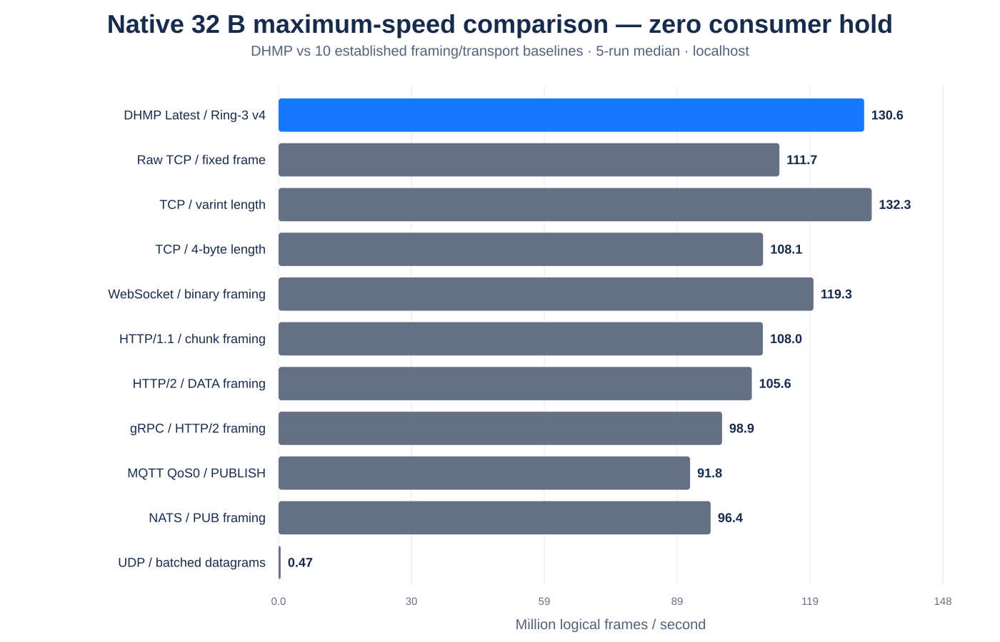
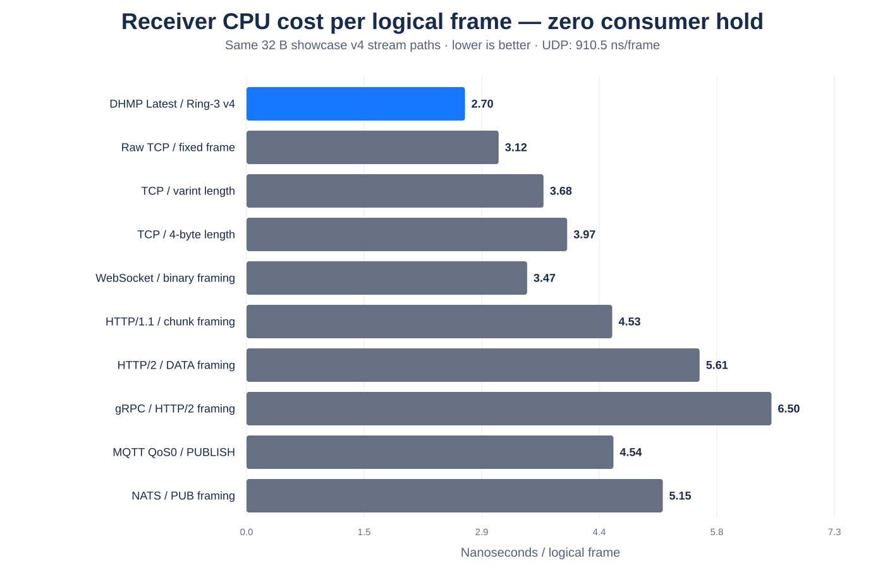

<p align="center">
  
</p>

# DHMP — Direct Headerless Message Protocol

DHMP is an experimental fixed-contract transport for persistent machine-to-machine communication.

The design goal is simple: **negotiate what can be known once, then keep repeated metadata, per-message allocation, queue growth, and unnecessary application work out of the steady-state hot path.**

DHMP is currently being developed as a protocol design plus reference implementations and benchmark labs. The main implementation target is .NET; native C labs are used to explore receive-path architectures before promising ideas are ported back into the .NET prototype.

> **Current highlighted `Latest` implementation:** Ring-3 Fixed-Slab Latest with a single-atomic `FRONT / MIDDLE / BACK` ownership exchange — three permanently retained state slots and one fixed reusable I/O workspace.

## At a glance

| Property | DHMP model |
| --- | --- |
| Framing | Fixed logical frame size negotiated once |
| Per-frame DHMP header | None in steady state |
| Connection model | Persistent continuous byte stream |
| Receive semantics | **Every** or **Latest** |
| Latest retention | Bounded newest-state window |
| Latest overflow | Always overwrite the oldest retained state |
| Delivery semantics | **Unconfirmed** or **Verified** |
| Secure mode | **DHMPS** over platform TLS |
| Memory model | Fixed reusable transport workspace + bounded retained state |
| Main target | Service-to-service, game/server state, telemetry, replication, devices |

## Why DHMP?

Many application protocols repeatedly send information that both peers already know after connection setup: schema identity, payload size, route information, message type, framing metadata, and other fixed contract details.

DHMP explores the opposite model:

```text
connection setup
    ↓
negotiate contract + fixed frame size + semantics
    ↓

steady state
[frame][frame][frame][frame][frame]...
```

rather than:

```text
[type][length][metadata][payload]
[type][length][metadata][payload]
[type][length][metadata][payload]
```

DHMP does **not** attempt to replace TCP reliability or TLS security. It sits above the underlying transport and removes application-level work that does not need to be repeated for every fixed-contract frame.

## Continuous data-pump model

A logical DHMP frame does not need to equal one socket read or write.

```text
TCP byte stream
      │
      ▼
┌──────────────────────────────┐
│ fixed reusable I/O workspace │
│ frame frame frame ... frame  │
└──────────────────────────────┘
      │
      ├── Every  → expose every complete frame
      │
      └── Latest → retain only newest useful state
```

This lets the implementation amortize one socket operation across many logical frames.

For `Latest`, obsolete complete frames do not need to become queued application objects at all. Once the negotiated frame size is known, the receiver can identify complete frame boundaries using fixed-size arithmetic and skip state that can no longer be observed.

## Receive semantics

### Every

`Every` exposes every complete logical frame in order.

Typical workloads:

- command streams;
- replication/change feeds;
- logs;
- telemetry where each sample matters;
- transactions or events that must not be discarded.

### Latest

`Latest` is for current-state workloads where newer state makes older state obsolete.

Typical workloads:

- game/server state;
- player or vehicle transforms;
- controller/device state;
- dashboards;
- simulation state;
- live UI state;
- high-frequency telemetry snapshots.

If the stream contains:

```text
[1][2][3][4][5]
```

and the consumer has fallen behind, a `Latest` implementation is allowed to discard stale state instead of forcing the application to process a growing backlog.

## Current Latest fast path: Ring-3 Fixed-Slab

The current highlighted native architecture uses two separate fixed-memory concepts:

1. **transport workspace** — a reusable contiguous slab that lets the OS perform efficient larger socket reads;
2. **retained state** — exactly three permanent buffers used as `FRONT / MIDDLE / BACK` ownership roles.

```text
network
   │
   ▼
┌──────────────────────────┐
│ fixed receive workspace  │
│ overwritten every cycle  │
└──────────────────────────┘
   │
   │ identify complete frames
   │ skip obsolete history
   ▼
┌────────┬────────┬────────┐
│ FRONT  │ MIDDLE │  BACK  │
└────────┴────────┴────────┘
 consumer   latest   producer
```

The producer writes only to `BACK`, then publishes it by atomically exchanging `BACK ↔ MIDDLE`. The consumer owns `FRONT`; when a newer state is available it exchanges `FRONT ↔ MIDDLE`. An older unconsumed `MIDDLE` state may be replaced by a newer one, which is exactly the intended `Latest` conflation behavior.

The implementation does not shift old frame data forward, grow a queue, or clear memory before reuse. Payload storage stays fixed; only ownership roles move.

For a 32-byte contract:

```text
3 × 32 B = 96 B retained application-state payload
```

The retained-state requirement stays constant regardless of how long the connection runs.

### Current Ring-3 CPU work

The current native fast path uses the single-atomic `FRONT / MIDDLE / BACK` exchange, a 32-bit middle token, negotiated fixed-size arithmetic, fixed-width carry handling, and the fixed-slab receive model.

Controlled CPU A/B work is retained in [the detailed benchmark documentation](docs/BENCHMARKS.md). The main README intentionally keeps only the newest integrated comparison graphs.

## Performance comparisons

### Current maximum-speed showcase v4 — zero artificial consumer delay

The headline native comparison now removes the previous 10 µs simulated application hold completely.

The consumer validates an acquired state and releases it immediately. There is **no clock-based delay in the hot consumer loop**.

Test profile:

- 32-byte logical payloads;
- 12 KiB reusable receive workspace;
- 256 KiB reusable sender batch;
- Ring-3 `FRONT / MIDDLE / BACK` publication;
- zero artificial consumer hold;
- 500 ms warmup;
- 1.2 second measured interval;
- five runs per path with rotated order;
- sender, receiver, and consumer pinned to separate CPUs when available;
- payload and framing validation enabled.

The comparison includes DHMP plus ten established transport/framing baselines: raw fixed TCP, varint-length TCP, 4-byte-length TCP, WebSocket binary framing, HTTP/1.1 chunk framing, HTTP/2 DATA framing, gRPC/HTTP2 message framing, MQTT QoS 0 PUBLISH framing, NATS PUB framing, and batched UDP datagrams.





Five-run medians:

| Path | Logical input | Zero-hold useful publications | Receiver CPU / logical frame | Input run range |
| --- | ---: | ---: | ---: | ---: |
| **DHMP Latest / Ring-3 v4** | **130.62 M/s** | **359.36k/s** | **2.704 ns** | 51.48–154.97 M/s |
| Raw TCP / fixed frame | 111.73 M/s | 297.88k/s | 3.120 ns | 73.31–138.52 M/s |
| TCP / varint length | 132.30 M/s | 364.60k/s | 3.676 ns | 91.11–137.70 M/s |
| TCP / 4-byte length | 108.08 M/s | 327.63k/s | 3.969 ns | 90.00–124.87 M/s |
| WebSocket / binary framing | 119.32 M/s | 341.47k/s | 3.474 ns | 83.11–127.03 M/s |
| HTTP/1.1 / chunk framing | 108.03 M/s | 356.19k/s | 4.527 ns | 78.10–121.40 M/s |
| HTTP/2 / DATA framing | 105.57 M/s | 356.20k/s | 5.608 ns | 95.19–114.91 M/s |
| gRPC / HTTP/2 framing | 98.92 M/s | 382.60k/s | 6.498 ns | 84.25–102.49 M/s |
| MQTT QoS 0 / PUBLISH | 91.79 M/s | 298.73k/s | 4.542 ns | 53.92–119.64 M/s |
| NATS / PUB framing | 96.38 M/s | 341.67k/s | 5.153 ns | 35.97–105.91 M/s |
| UDP / batched datagrams | 0.466 M/s | 107.64k/s | 910.50 ns | 0.437–0.552 M/s |

All retained v4 runs reported **zero payload-validation errors and zero framing-validation errors**.

Removing the artificial hold changed the visible DHMP publication rate from the old ~74k/s stress-test range to a median **359k/s** in this maximum-speed suite. That is why the old 10 µs graph is no longer used as the headline speed comparison.

A few interpretation rules matter:

- Raw fixed TCP and DHMP perform essentially the same fixed-record wire work in this harness. Small differences between them are measurement variance, not evidence that DHMP makes TCP itself faster.
- The localhost environment is noisy; the published ranges are intentionally retained.
- The HTTP, WebSocket, gRPC, MQTT, and NATS rows measure their framing hot paths in the same native harness. They are **not full production framework/server stacks**.
- Useful-publication rate is a Latest batch/freshness metric, not a per-frame processor ceiling. Latest publishes at most one newest state per receive batch.
- These are logical loopback rates, not physical NIC throughput.

Methodology: [showcase v4 zero-hold notes](benchmarks/native-showcase/V4_ZERO_HOLD.md)  
Summary CSV: [showcase-v4-zero-hold-32b-summary-5run-2026-09-23.csv](benchmarks/results/showcase-v4-zero-hold-32b-summary-5run-2026-09-23.csv)

### Historical results

Older 10 µs slow-consumer, .NET request/reply, DHMPS/HTTPS, and native showcase measurements remain in [the detailed benchmark history](docs/BENCHMARKS.md) for reproducibility, but are intentionally omitted from the main README.

## Continuous streaming results

The .NET continuous-streaming benchmark removes request/reply waiting and sends fixed-size frames continuously.

| Payload | DHMP frames/s | Payload throughput |
| ---: | ---: | ---: |
| 16 B | ~206k | ~3.15 MiB/s |
| 32 B | ~228k | ~6.95 MiB/s |
| 64 B | ~224k | ~13.65 MiB/s |
| 128 B | ~222k | ~27.15 MiB/s |
| 256 B | ~225k | ~54.92 MiB/s |
| 512 B | ~218k | ~106.41 MiB/s |
| 1 KiB | ~207k | ~202.21 MiB/s |
| 2 KiB | ~192k | ~374.33 MiB/s |
| 4 KiB | ~179k | ~697.79 MiB/s |
| 8 KiB | ~141k | ~1.10 GiB/s |

These results illustrate the transition from per-operation overhead at small frame sizes toward byte movement, socket buffering, and memory bandwidth at larger sizes.

## Delivery semantics

Receive semantics and delivery/recovery semantics are separate.

### Unconfirmed

The sender continuously emits frames without requiring DHMP-level proof that the peer accepted every logical frame.

TCP still provides ordered reliable byte delivery while the connection remains alive. If the session dies, uncertain application frames may be abandoned.

### Verified

Verified keeps the same no-wait hot data stream:

- no per-frame ACK;
- no periodic ACK merely because data is flowing;
- sender continues sending;
- sender retains uncertain logical history;
- reconnect/verification establishes the receiver's accepted stream position;
- only the uncertain tail is replayed.

The remaining design problem is **bounded Verified history**: asynchronous checkpoints need to confirm an accepted position so old retained history can be released without turning the normal stream into request/reply traffic.

## DHMP and DHMPS

**DHMP** is the plain application transport.

**DHMPS** is DHMP carried through normal platform TLS.

DHMPS does not invent custom cryptography. TLS framing exists below DHMP, while DHMP itself keeps the same fixed-contract application-frame model.

## Intended use cases

DHMP is being explored for workloads such as:

- service-to-service communication;
- multiplayer game/server state;
- controller/device communication;
- real-time state distribution;
- telemetry;
- simulation;
- cache synchronization;
- replication/change feeds;
- log shipping;
- edge/backend synchronization.

The strongest fit is communication that is:

- persistent;
- high-frequency;
- fixed-contract;
- small-to-medium message oriented;
- sensitive to allocation, queue growth, or stale-state processing.

DHMP is **not** intended to reproduce every feature of HTTP, gRPC, Kafka, MQTT, QUIC, or a message broker inside one protocol. Higher-level features should remain layered above the small transport core.

## Benchmark discipline

DHMP uses several different benchmark harnesses. Their absolute numbers should not be mixed casually.

- **.NET protocol benchmarks** compare real .NET stacks and application APIs.
- **native showcase benchmarks** compare framing/ingestion paths inside one C harness.
- **processor-path labs** explore algorithms and memory models.
- **Ring-3 standalone tests** validate the newest bounded-state implementation shape.

A higher native-lab number does not mean the .NET implementation currently achieves the same rate, and a logical payload rate does not mean a physical NIC transferred that many bytes per second.

Raw CSV files, source code, methodology, and caveats are retained so results remain reproducible.

## Current status

DHMP is experimental work and is not yet a frozen interoperability specification.

Established so far:

- fixed-contract/headerless steady-state framing;
- arbitrary negotiated fixed frame sizes;
- `Every` and `Latest` receive semantics;
- Ring-3 bounded newest-state implementation experiments;
- single-atomic `FRONT / MIDDLE / BACK` Ring-3 ownership exchange;
- overwrite-oldest Latest behavior;
- fixed reusable I/O workspace;
- plain DHMP and TLS-wrapped DHMPS;
- Unconfirmed delivery;
- no-periodic-ACK Verified recovery;
- reconnect/replay of uncertain Verified tails;
- reusable-slab/bulk-I/O implementation model;
- comparisons against lean TCP, MessagePack, WebSocket, HTTP, HTTPS, UDP, and gRPC.

Current engineering priorities:

1. port Ring-3 Fixed-Slab Latest and the bounded output-slab Every path into .NET, including direct slab-to-send forwarding and a batch-first optional delivery worker;
2. extend showcase v4 zero-hold across negotiated frame sizes;
3. repeat showcase v4 with longer runs and on physical LAN hardware to reduce localhost scheduling variance;
4. tune receive-workspace and sender-batch sizing across negotiated frame sizes;
5. implement bounded Verified checkpoints;
6. continue separating protocol specification from implementation details;
7. build ergonomic .NET/Unity-facing APIs without adding per-frame wire overhead.

## Documentation

- [Protocol draft](docs/PROTOCOL_DRAFT.md)
- [Current development status](docs/CURRENT_STATUS.md)
- [Benchmark methodology and detailed results](docs/BENCHMARKS.md)
- [Native Gen-2 processor lab](benchmarks/native-gen2)
- [Raw benchmark results and charts](benchmarks/results)

## Requirements

The main prototype targets **.NET 10**.

A separate Linux/C native lab under `benchmarks/native-gen2` is used for architecture and processor-path experiments before selected ideas are ported to the .NET implementation.
