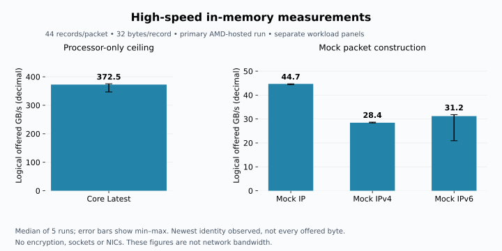
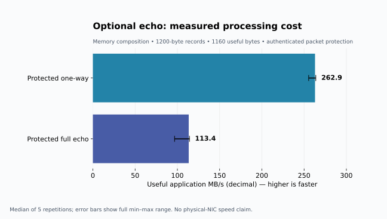
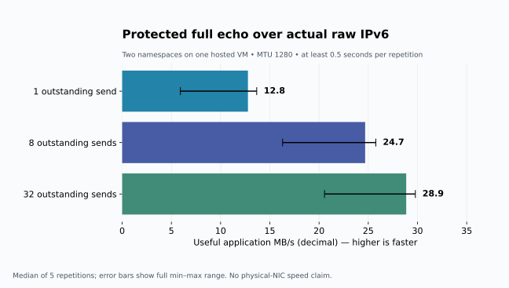

<p align="center">
  
</p>

# DHMP — Direct Headerless Message Protocol

**DHMP is a standalone message protocol being built directly over IP. IPv6 is the current implementation target.**

The active project has no TCP/UDP compatibility data path. Earlier stream and compatibility implementations remain in git history only.

<!-- BEGIN FULL BENCHMARK RESULTS -->
## Latest validation and benchmarks — 1 October 2026

**790 test executions passed: 395 cases on Linux and Windows.** The full hosted suite also passed 23 network acceptance checks, including deliberate loss, restart, clean shutdown and the optional full-echo profile.

[Benchmark run](https://github.com/Perry3Dnl/DHMP/actions/runs/36832616901) · [Test run](https://github.com/Perry3Dnl/DHMP/actions/runs/36832616933) · [Full results and contracts](docs/FULL_BENCHMARK_2026_10_01.md) · [Raw measurement JSON](docs/benchmark-results/2026-10-01)

Five repetitions per case on one GitHub-hosted VM: **4 vCPU, AMD EPYC 7763 64-Core Processor, .NET 10**. All units are decimal. These are memory, kernel-loopback and virtual-network measurements; physical two-machine/NIC throughput remains unmeasured.

### High-speed core and mock measurements (GB/s)

These are the fast **in-memory logical offered rates**, measured without encryption, sockets or NICs. All rows below use batch 44: 44 fixed 32-byte records, 1408 offered payload bytes per packet, on the primary AMD-hosted runner.

| In-memory benchmark | Logical offered GB/s, median (min–max) | ns/packet, median |
| --- | ---: | ---: |
| Core Latest framing ceiling | 372.534 (346.784–375.469) | 3.780 |
| Mock IP packet construction | 44.676 (44.324–44.725) | 31.516 |
| Mock IPv4 framing | 28.442 (28.374–28.696) | 49.504 |
| Mock IPv6 framing | 31.211 (20.921–31.828) | 45.112 |



The core ceiling validates the batch boundary and observes one int32 from the newest record. The mocks construct records and observe the newest identity; IPv4/IPv6 cases add their respective header work. **They do not inspect or transmit every offered byte**, so these logical rates are not full-payload processing or network bandwidth, and the different workloads are not equivalent speed rankings.

The earlier Intel-hosted mock IP run measured **51.446 GB/s median (44.500–53.468)** at the same batch size. Its [raw results](docs/benchmark-results/2026-10-01/initial-components-kernel.json) and [run](https://github.com/Perry3Dnl/DHMP/actions/runs/36831931127) are retained separately. Different hosted CPUs prevent treating the difference as a protocol regression.

### Protected one-way versus optional full echo: memory composition

Both cases use 1200-byte records and 1160 useful application bytes. Timing includes real protection/decryption and byte checks, with no sockets. Echo also sends the entire return record and matches its confirmation. Useful bytes are counted once.

| Mode | Useful MB/s, median (min–max) | Time per send/confirmation | Approx. allocated bytes/op |
| --- | ---: | ---: | ---: |
| Protected one-way | 262.9 (255.4–263.8) | 4.41 µs | 0 |
| Protected full echo | 113.4 (96.7–114.3) | 10.23 µs | 3,472 |



Full echo took **2.32×** the CPU time per operation in this harness. It remains opt-in; neither mode adds automatic retransmission.

### Full echo through actual protected raw IPv6 sockets

These peers run in two namespaces on the **same VM**, not on separate physical machines. Records are encrypted and their returned content is checked. Each sample lasts at least 0.5 seconds after warm-up, with rotated concurrency order. This is measured useful completion throughput, not a physical link capacity.

| Outstanding sends | Useful MB/s, median (min–max) | Median sample p50 RTT | Median sample p95 RTT |
| ---: | ---: | ---: | ---: |
| 1 | 12.8 (5.9–13.7) | 0.085 ms | 0.112 ms |
| 8 | 24.7 (16.3–25.8) | 0.130 ms | 0.283 ms |
| 32 | 28.9 (20.6–29.8) | 0.239 ms | 0.813 ms |



### Existing ASP.NET API path

The local HTTP driver calls the website, which calls its backend through protected raw DHMP. Measurements include that whole application path. The fixture intentionally caps each API sender at **500 records/s**; the 16 KB POST spans many records and therefore reflects configured pacing, not maximum protocol bandwidth. Five samples of 40 successful requests per route, after warm-up.

| API call | Requests/s, median | Median sample p50 | Median sample p95 |
| --- | ---: | ---: | ---: |
| GET | 488.9 | 2.323 ms | 2.538 ms |
| 16 KB JSON POST + echo response | 13.6 | 73.292 ms | 74.653 ms |

### Unprotected raw kernel loopback: verified delivery

Every delivered record's identity and bytes are checked. Each run offers 200,000 records of 32 bytes, without intentional pacing. Unique received payload and loss are reported separately; duplicate records never inflate throughput. Drain waiting is excluded from the active-rate denominator.

| Records/packet | Unique received MB/s, median (min–max) | Loss %, median (min–max) |
| ---: | ---: | ---: |
| 1 | 5.1 (4.7–6.8) | 0.00 (0.00–0.00) |
| 8 | 43.4 (37.8–44.4) | 0.00 (0.00–0.00) |
| 44 | 143.1 (141.7–144.3) | 0.00 (0.00–0.00) |

**The primary run had no observed kernel loss. An earlier run on a different hosted CPU lost 17.23% at batch 44 (15.80–19.58%).** Both sets of raw measurements are retained. This shows that unpaced sender/receiver/kernel overload can occur; a loss-free run does not establish reliable delivery. The protected echo and API measurements above are different workloads and cannot be ranked against this kernel test as equivalent modes.

Core, mock IPv4/IPv6, control-codec, generation-filter, security/feedback and key-derivation timings are retained in the [complete report](docs/FULL_BENCHMARK_2026_10_01.md). Large logical offered rates from the historical-contract memory harnesses are not network bandwidth. License, routing, replay, limits, cancellation and lifetime behavior are covered by tests; long-duration soak, physical networks, fairness and independent security review remain open.
<!-- END FULL BENCHMARK RESULTS -->

## V1 data-plane rule

DHMP V1 keeps the hot data path deliberately simple:

```text
IPv6 packet
  -> DHMP headerless payload
     -> fixed record
     -> fixed record
     -> fixed record
```

There are **zero DHMP header bytes** before the first record, between records or after the last record.

The current raw IPv6 research path uses experimental IPv6 protocol / Next Header `253` for headerless DHMP data and `254` for DHMP control/handshake packets. Neither value is a permanent DHMP assignment.

Before data packets are exchanged, endpoints can run the implemented Control V1 HELLO/ACCEPT/REJECT handshake for an already configured IPv6 peer. It verifies wire version, fixed record size and schema identity, exchanges receive capability and clamps the local send ceiling. Pmax and Latest/Sequential remain local. Peer discovery is still future work; optional PSK possession authentication is provided by the separate experimental security profile.

## Active architecture

IP packet I/O -> complete headerless DHMP payload -> fixed-contract validation ->
Latest or Sequential publication -> typed/application boundary.

- One message is one fixed-size record.
- One IP packet carries one or more whole records.
- A record never continues in another packet.
- Invalid or incomplete packets are rejected as a whole.
- Sequential publishes complete records in receive order.
- Latest publishes the final record of the received packet.
- V1 has no protocol-owned cross-packet sequence field. Optional `DhmpLatestGenerationFilter` can use an application-owned 64-bit generation inside the record to drop stale/duplicate Latest state without adding DHMP bytes.
- DHMP adds no delivery ACK, retransmission, replay history or hidden reliable queue.
- Buffer ownership must be explicit across asynchronous boundaries.
- Pmax is local sender policy. `RejectWindow` preserves the hard fixed-window budget; `SmoothPacing` spaces packet submissions over time. With the PSK profile, authenticated receiver overload feedback and rolling secure-path loss telemetry can adapt SmoothPacing downward and recover gradually. RTT is measured but not yet used as an independent throttle signal; this is still not a complete network congestion-control algorithm.

## What exists today

| Component | Status |
| --- | --- |
| Headerless fixed-record packet processor | Implemented |
| `DhmpWireContract` + separate send/receive policies | Implemented |
| Client packet facade | Uses an explicitly supplied direct-IP sender |
| Server packet facade | Processes already-received complete IP payloads |
| Licensing and ASP.NET host integration | Offline validation at host startup |
| Raw IPv6 kernel experiment | Experimental loopback harness |
| `DHMP.RawIpv6` Linux backend | Direct data sender/receiver plus Control V1 handshake for a configured peer |
| Compatibility/capability negotiation | Implemented HELLO/ACCEPT/REJECT; discovery still pending |
| Multi-peer server routing | Source IPv6 routing with drained removal/replacement; one registered V1 session per address |
| Cross-packet Latest freshness | Implemented opt-in application-generation filter; no extra DHMP wire bytes |
| Smooth local pacing | Implemented opt-in Pmax pacing with experimental authenticated pressure adaptation |
| IPv6 path-MTU budgeting | Implemented known-PMTU budgeting + whole-record/security alignment; dynamic PMTUD still pending |
| Bounded async receive overload | Implemented: Latest replaces one pending batch; Sequential rejects when bounded queue is full |
| PSK secure packet profile | Experimental ChaCha20-Poly1305/HKDF/HMAC profile with V2 challenge/confirm setup; independent review pending |
| Authenticated receiver backpressure | Implemented experimental pressure feedback + bounded adaptive pacing |
| Secure path telemetry | Implemented rolling protected-packet loss window + authenticated RTT probe/echo |
| Full network congestion control and forward-secret/public-key security | Still to specify/build |

Removing the old transports does **not** mean a production-ready network stack already exists. The repository now intentionally favors a clean protocol boundary over temporary compatibility.

## .NET packages

All active projects target .NET 10 and use the canonical `DHMP.*` spelling.

| Project | Responsibility |
| --- | --- |
| DHMP.Protocol | Wire contract, local policies, packet processor, control codec/negotiation, budget and direct-IP sender boundary |
| DHMP.Client | Per-session sending facade |
| DHMP.Server | Per-session receiving facade and typed/buffer ownership building blocks |
| DHMP.Licensing | Offline key verification |
| DHMP.AspNetCore | Dependency injection and license/startup gating |
| DHMP.RawIpv6 | Linux raw-IPv6 data path, bounded source-address multi-peer routing, compatibility and PSK security handshakes |
| DHMP.Security | Experimental PSK packet protection, replay window and protected sender wrapper |

`AddDHMP(applicationId, licenseKey, publicVerificationKey)` configures the license gate. It does not bind an endpoint or create a hidden transport.

A `DhmpWireContract`, `DhmpSendPolicy` and an `IDhmpPacketSender` are required for a client. A server uses the same wire contract with its own `DhmpReceivePolicy`. `DhmpRawIpv6PacketSender` is the first concrete sender implementation. The optional `DHMP.Security` profile can wrap that sender and decode before the server; it adds 24 bytes per protected data packet. Creating raw IPv6 sockets on Linux requires appropriate raw-socket privileges/capabilities.

## Validation

```sh
python3 tools/check_architecture.py
dotnet test tests/DHMP.Protocol.Tests -c Release
dotnet test tests/DHMP.AspNetCore.Tests -c Release
dotnet test tests/DHMP.Licensing.Tests -c Release
dotnet test tests/DHMP.RawIpv6.Tests -c Release
dotnet test tests/DHMP.Security.Tests -c Release
```

CI guards the architecture, unit/integration tests and compilation of the direct-IP backend. Physical two-host measurements and privileged raw-socket validation remain separate. The [first two-host smoke run](docs/TWO_HOST_SMOKE.md) provides a low-rate real-backend runner and acceptance criteria. See [session shutdown](docs/SESSION_SHUTDOWN.md) for outgoing/control resource ownership.

## Measurements and history

[Benchmark scope and retained evidence](docs/BENCHMARKS.md) separates memory experiments, kernel experiments and physical network results. There is no published production direct-IP speedup claim.

Earlier stream-framing and compatibility results remain in [git history](https://github.com/Perry3Dnl/DHMP/tree/7b85bd961b12d433ed8fd3ea3b5f623dc47a20e7). They are historical evidence, not the active runtime architecture.

## Documentation

- [DHMP wire contract V1](docs/WIRE_CONTRACT_V1.md)
- [DHMP control plane V1](docs/CONTROL_PLANE_V1.md)
- [DHMP PSK security setup V2](docs/SECURITY_PSK_V2.md)
- [Bounded overload behavior](docs/OVERLOAD_BEHAVIOR.md)
- [Peer receive lifecycle and retirement](docs/PEER_LIFECYCLE.md)
- [Authenticated congestion feedback](docs/CONGESTION_FEEDBACK.md)
- [Test strategy](docs/TEST_STRATEGY.md)
- [Authoritative direct-IP direction](docs/DIRECT_TRANSPORT_DIRECTION.md)
- [Current implementation status](docs/CURRENT_STATUS.md)
- [Stable-base release acceptance plan](docs/STABLE_BASE_RELEASE.md)
- [Protocol design notes](docs/PROTOCOL_DRAFT.md)
- [Architecture and ownership](docs/ARCHITECTURE_COMPARISON.md)
- [.NET API design](docs/DOTNET10_PACKAGE_DESIGN.md)
- [Conformance](docs/CONFORMANCE.md)
- [Licensing](docs/LICENSING_DESIGN.md)
- [Direct-IP implementation plan](docs/TRANSPORT_TUNING_TODO.md)

## Opt-in automatic .NET API integration

`builder.Services.AddDHMP(licenseKey)` can load configured peer/license settings and route factory-created calls for one API origin over authenticated raw DHMP IPv6, reusing the backend ASP.NET pipeline. Existing controllers and client calls can remain unchanged within the supported buffered API profile. This new experimental integration requires both endpoints, deployment configuration and Linux raw-socket privileges; it is not a published/stable NuGet release or a browser transport. See [configuration and example](docs/ASP_NET_API_INTEGRATION.md) and the explicit [DAPI/1 application schema](docs/API_APPLICATION_PROFILE_V1.md).

The [GitHub-hosted API rehearsal](docs/HOSTED_API_REHEARSAL.md) exercises real raw sockets and ASP.NET apps across two isolated virtual network environments, including loss and restart. This remains separate from the required physical two-host validation.

Optional [full-echo confirmation (DECO/1)](docs/ECHO_CONFIRMATION_PROFILE_V1.md) can verify matching received records above the unchanged V1 framing core. It is explicit opt-in and adds no automatic retransmission or application-execution guarantee.
