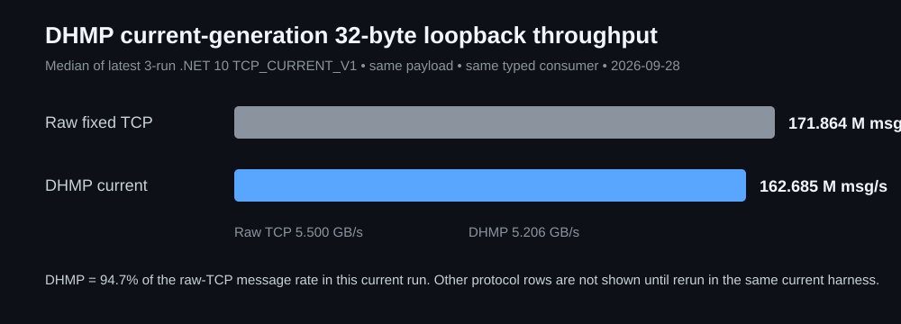

<p align="center">
  
</p>

# DHMP — Direct Headerless Message Protocol

DHMP is an experimental fixed-contract protocol for persistent machine-to-machine communication. Its steady-state design is simple: negotiate what can be known once, then keep repeated metadata, avoidable copies, per-message synchronization and unbounded queue growth out of the hot path.

## Protocol contract

DHMP is fire-and-forget and fixed-contract.

- One logical application message MUST fit completely inside the negotiated fixed payload contract.
- DHMP does not fragment or reassemble application messages.
- Oversize sends MUST be rejected before bytes enter the send path.
- DHMP defines no per-message delivery ACK, replay or reconnect history.
- Senders are bounded by a configured processing ceiling `Pmax`; exceeding the budget must not create an unbounded reliable queue.
- TCP/TLS may segment or coalesce the byte stream internally. That is transport behavior, not DHMP fragmentation.
- DHMPS is DHMP over standard TLS; DHMP does not define custom cryptography.

# Current performance

> **Performance-data policy:** this README contains only current-generation benchmark results. Historical benchmark data remains available under `benchmarks/` and `docs/`, but old results are not mixed into the current headline comparison.

## Current verified result — DHMP vs raw TCP

<p align="center">
  
</p>

The latest `.NET 10` `TCP_CURRENT_V1` comparison uses the same 32-byte payload, loopback socket path, 64 KiB send chunks and the same static-abstract typed consumer for both paths.

| Path | Median logical messages/s | Median logical payload | Median time/message |
| --- | ---: | ---: | ---: |
| Raw fixed TCP | **171.864 M/s** | **5.500 GB/s** | **5.819 ns** |
| DHMP current | **162.685 M/s** | **5.206 GB/s** | **6.147 ns** |

On this run DHMP reaches **94.7% of raw fixed TCP's message rate**. Raw TCP remains the correct lower-overhead baseline: DHMP does additional fixed-contract framing/typed-boundary work.

The individual DHMP runs were 153.727, 166.790 and 162.685 M messages/s. The raw-TCP runs were 154.408, 171.864 and 177.360 M messages/s. Three runs are enough for a current checkpoint, not for a claim that a few-percent difference is universally stable.

## The comparison we are building next

The next public graph will use **one frozen current-generation harness**. No historical v6 values and no third-party benchmark numbers will be inserted into the bars.

The comparison set is deliberately split into two useful groups. Some protocols appear in both groups because being widely deployed and being performance-relevant are different properties.

### Five performance-relevant targets

| Target | Why it belongs in the comparison | Current same-harness result |
| --- | --- | --- |
| Raw fixed TCP | Practical minimum-overhead reliable byte-stream baseline | **Measured** |
| UDP datagrams | Minimal datagram transport reference; semantics differ from DHMP | Pending |
| QUIC / HTTP/3 transport | Modern UDP-based multiplexed reliable transport | Pending |
| WebSocket binary | Persistent message-oriented application transport | Pending |
| gRPC streaming / HTTP/2 | High-performance typed service/streaming stack | Pending |

### Five widely recognized application/messaging targets

| Target | Why it belongs in the comparison | Current same-harness result |
| --- | --- | --- |
| HTTP/1.1 | Ubiquitous request/response baseline | Pending |
| HTTP/2 | Widely deployed multiplexed HTTP transport | Pending |
| WebSocket binary | Common persistent real-time channel | Pending |
| gRPC streaming | Common typed service-to-service RPC/streaming stack | Pending |
| MQTT QoS 0 | Common lightweight telemetry/IoT messaging protocol | Pending |

NATS will also be retained as an additional messaging-system reference once the official/version-pinned client/server benchmark is available.

**A protocol gets a performance bar only after it has actually run under the frozen current harness.** This prevents an attractive graph from becoming an invalid comparison between different CPUs, runtimes, payloads, implementations or benchmark generations.

Independent research also supports keeping these categories separate: raw TCP tends to minimize baseline protocol overhead, while higher-level protocols add semantics, multiplexing, framing or ecosystem features that change both cost and behavior. The DHMP repository therefore treats throughput as one measured property, not as proof that protocols with different semantics are interchangeable.

# What DHMP optimizes

DHMP targets workloads containing many small, fixed-layout state/event messages where both endpoints already know the connection contract.

```text
TCP / TLS byte stream
        ↓
DHMP Stream Processor
  fixed-size package extraction
  payload remains opaque
        ↓
borrowed contiguous package span
        ↓
.NET typed boundary
  zero-copy typed view where layout permits
        ↓
ReadOnlySpan<T> / usable typed data
===============================
DHMP performance scope ends
===============================
        ↓
application / game / service logic
```

The Stream Processor and the .NET typed boundary are optimized independently. The processor does not materialize C# models, dispatch application workers or execute business logic.

## Receive semantics

`Latest` allows a newer state to replace stale unconsumed state. It is intended for state where processing obsolete updates has no value.

`Sequential` offers every complete package that reaches the receive path in FIFO order, but remains bounded. DHMP still does not add an application-level delivery guarantee.

Neither mode changes the maximum-payload rule.

# Protocol versus implementation

| Protocol-level contract | Runtime / implementation detail |
| --- | --- |
| Fixed connection contract | Receive-region/slab sizing |
| Fixed deterministic wire layout | Region ownership implementation |
| `Latest` / `Sequential` semantics | .NET typed-span adapter |
| Fire-and-forget delivery | CPU/cache placement |
| No application-message fragmentation | Socket buffer tuning |
| DHMP / DHMPS | Batching and polling strategy |

The protocol is intended to be implementable outside .NET. The NuGet packages are the reference .NET implementation, not the definition of the protocol itself.

# .NET 10 packages

| Package | Purpose |
| --- | --- |
| `DHMP.Protocol` | wire contract, stream processor and protocol invariants |
| `DHMP.Client` | client connection/send surface |
| `DHMP.Server` | server listener/session/runtime surface |
| `DHMP.AspNetCore` | ASP.NET Core DI and hosted lifecycle integration |

Target ASP.NET Core setup:

```csharp
var builder = WebApplication.CreateBuilder(args);
builder.Services.AddDHMP();

var app = builder.Build();
app.Run();
```

The common setup should stay small. Advanced transport/runtime tuning must remain optional.

# Benchmark rules

Current and future public comparison graphs follow these rules:

1. Same machine and CPU allocation for compared paths.
2. Same logical payload and message count.
3. Same application-level consumer work.
4. Same warmup and measurement policy.
5. Multiple rotated runs; median plus run distribution retained.
6. Exact implementation/version recorded for every external stack.
7. Network throughput, logical payload throughput and processor-only capacity are labelled separately.
8. A processor microbenchmark is never presented as NIC/network throughput.
9. Different benchmark generations are never combined into one performance ranking.
10. If DHMP loses a fair test, the slower DHMP result is published.

# Current engineering priorities

1. Expand `TCP_CURRENT_V1` into the frozen current cross-protocol harness.
2. Run the five performance-relevant and five widely recognized targets above with real/version-pinned implementations.
3. Increase the current TCP/DHMP comparison from three short runs to longer rotated runs before making small percentage claims.
4. Add a fresh DHMPS/TLS comparison under the same-generation secure harness.
5. Continue optimizing Stream Processor and .NET boundary independently without moving application work into DHMP's benchmark scope.

# Documentation

- [Architecture comparison](docs/ARCHITECTURE_COMPARISON.md)
- [Current development status](docs/CURRENT_STATUS.md)
- [Protocol draft](docs/PROTOCOL_DRAFT.md)
- [Benchmark methodology/history](docs/BENCHMARKS.md)
- [Transport/runtime tuning](docs/TRANSPORT_TUNING_TODO.md)
- [Native benchmark labs](benchmarks/native-showcase)
- [Processor labs](benchmarks/native-gen2)
- [Raw benchmark results](benchmarks/results)

# Requirements

The primary reference implementation target is **.NET 10**.
